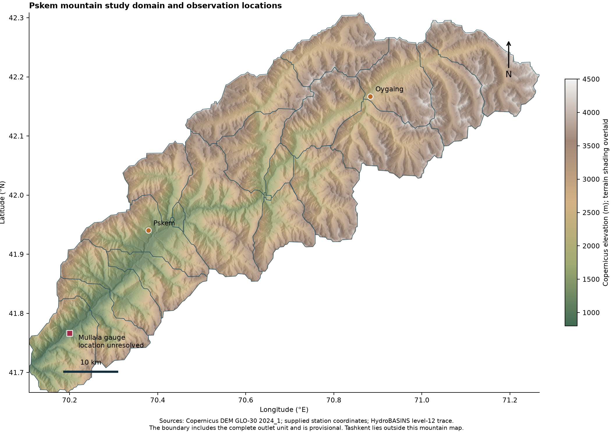
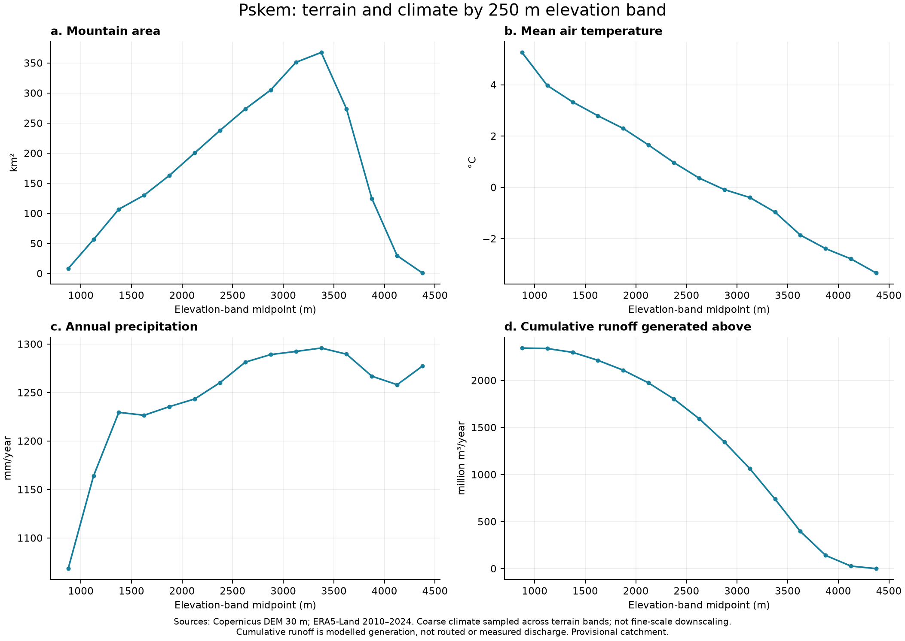
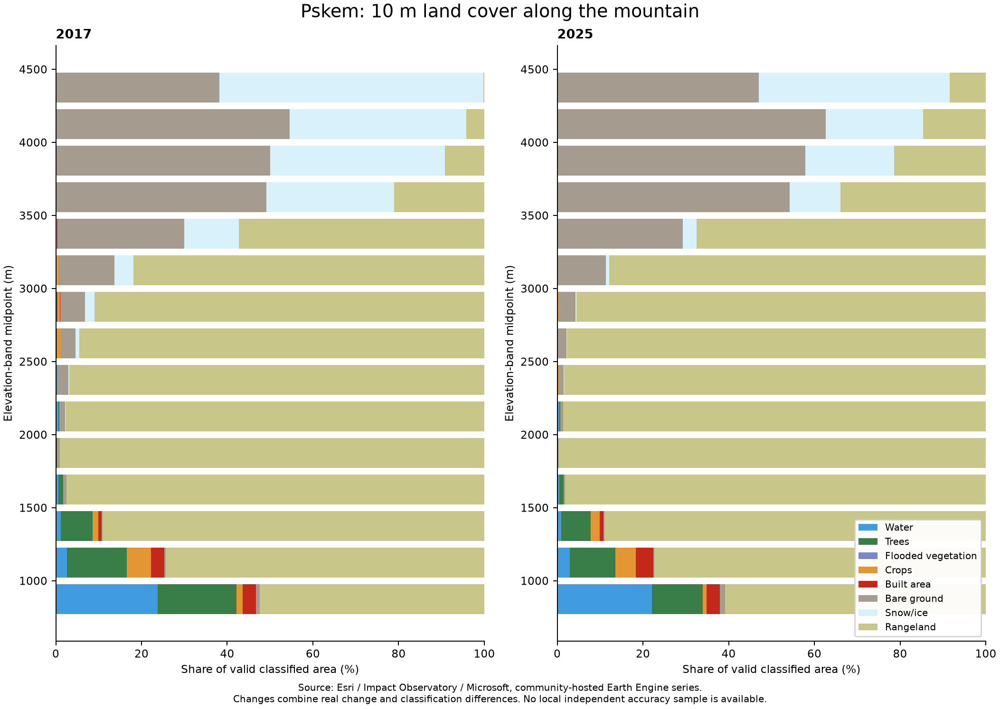
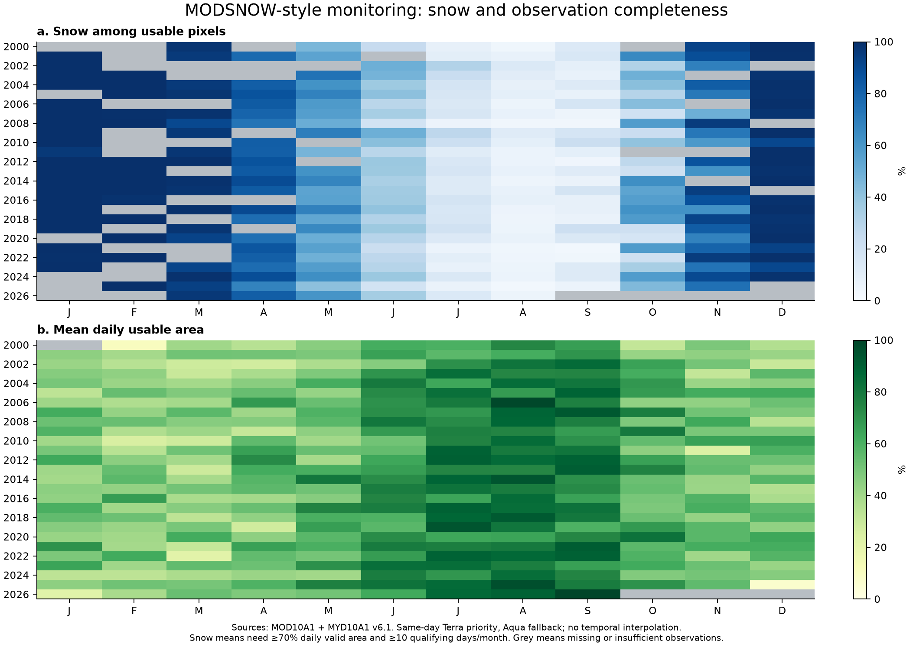
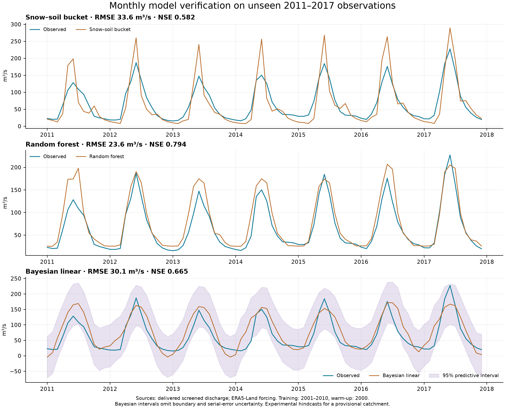
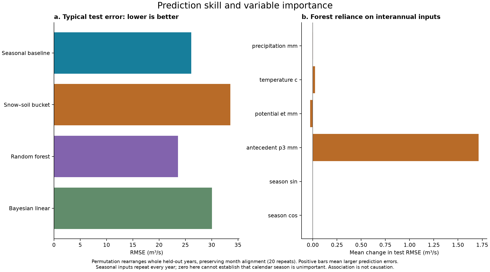
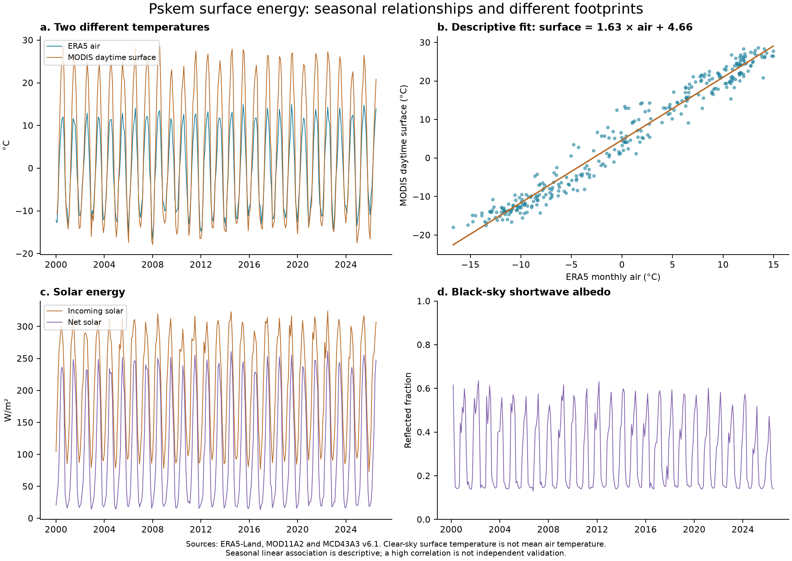
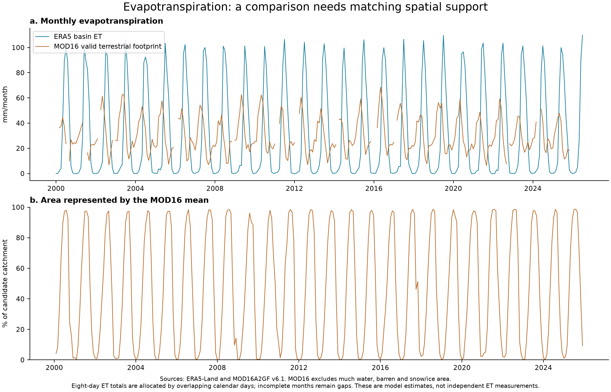
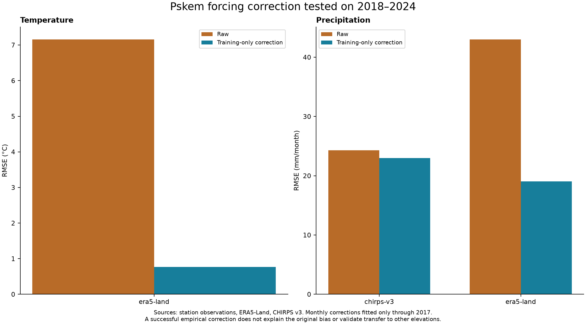
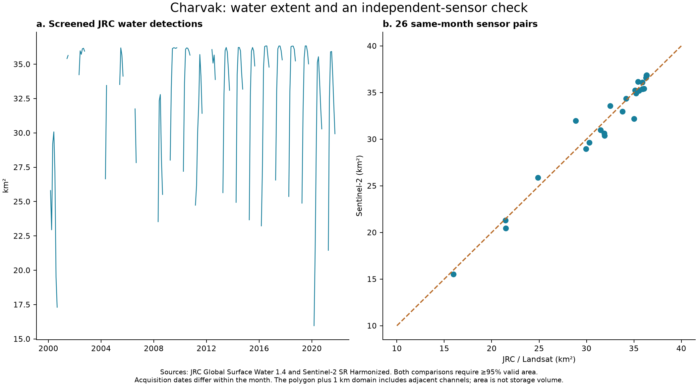

# Pskem mountain water: terrain, energy and model verification

The random forest produces the lowest monthly discharge RMSE among four tested specifications: 23.58 m³/s, a 9.6% reduction from the seasonal baseline on 84 held-out months. The physical snow–soil bucket conserves water but has higher prediction error; the Bayesian model supplies explicit uncertainty with a wide predictive range. These results support an exploratory model comparison, not an operational release.

The principal spatial problem is unresolved gauge identity. The stored coordinate is almost on a small tributary with 11.7 km² reference upstream area, whereas plausible Pskem main-stem reaches lie about 700 m away. The provisional domain contains the entire outlet level-12 unit. Every basin profile and calibrated model must be recomputed if the verified outlet changes.

## Terrain and land-cover evidence

The Copernicus elevation-band reduction represents 2630.4 km². The largest 250 m band is 3250–3500 m, containing 367.5 km². Charts show area, mean air temperature, annual precipitation, local runoff generation, and runoff accumulated from higher bands. The DEM is a 30 m digital surface model. It updates the terrain source but does not provide finer nominal resolution than SRTM 30 m.[^5]

The 2010–2024 climate summary intersects coarse ERA5 cells with fine terrain bands. Temperature is the mean of 180 monthly means; annual precipitation and runoff use fifteen annual-equivalent totals. These profiles describe spatial association in the reanalysis. They are not station-derived lapse rates and do not contain independent 250 m climate information. Runoff depth multiplied by band area gives local generated volume; summing from high elevations downward does not route rivers or measure discharge at each elevation.[^1]

Esri/Impact Observatory classifications are available for 2017–2025 and were reduced at 10 m by elevation band. Rangeland, bare ground and seasonal snow/ice are especially relevant mountain classes. The stacked charts show class shares among valid mapped pixels. Cloud/unclassified areas are excluded and retained separately in the CSV. A mapped snow/ice class is not a glacier inventory, and class switches between years do not alone establish ecological change.[^6][^7]

No verified, openly licensed sub-30 m DEM was identified for this catchment. Resampling a 30 m model to 10 m would create smaller pixels without new terrain observations. A professional upgrade should compare surveyed control points or independently acquired stereo/lidar terrain before changing flow paths or claiming finer accuracy. Inter-product elevation spread is not error against ground truth.

## Temperature, radiation, albedo and evapotranspiration

The surface-energy charts separate two temperatures: ERA5 monthly 2 m air temperature and MODIS daytime clear-sky surface skin temperature. The latter measures the radiometric surface, which can heat much faster than the air. A fitted surface-versus-air line is descriptive and strongly affected by season, time of day and clear-sky sampling. It cannot validate station air temperature.[^1][^2]

Incoming solar radiation supplies energy; net solar radiation subtracts reflected shortwave energy. Monthly accumulated joules per square metre are divided by seconds in the calendar month to obtain mean watts per square metre. Albedo is the reflected fraction. MODIS black-sky shortwave albedo is a modelled directional illumination quantity, not a complete measured surface-energy balance. Daily MCD43 estimates use overlapping 16-day retrieval windows.[^1][^4]

Evapotranspiration combines water evaporating from surfaces and transpiring through vegetation. ERA5 ET is a basin reanalysis estimate. MOD16 ET is a terrestrial model with quality-filtered coverage that excludes much barren, water and snow/ice area. Its monthly means therefore represent a changing subset of this mountain basin. Eight-day ET totals are allocated to calendar months in proportion to overlapping days; months without all composite days remain blank. LST composite means receive duration weighting; albedo uses available daily retrievals. Similar-looking curves do not establish agreement on a common footprint.[^3]

## Physical model

Each monthly step divides precipitation between rain and snow with a smooth temperature-dependent fraction. Snow accumulates in a store. Positive monthly temperature produces potential degree-day melt, capped by snow availability. Rain plus melt feeds quick flow and a soil store; evapotranspiration is limited by soil water, excess spills to runoff, and a fraction of remaining soil water drains as baseflow. The model is an explicitly simplified numerical bucket, not a full energy-balance or glacier model.

The water balance is P − ET − Q − Δ(snow + soil) = 0 in equivalent depth. Runoff is converted to m³/s with the provisional catchment area and actual calendar-month length. Monthly mean temperature cannot reconstruct daily freezing crossings; melt timing is correspondingly approximate. Potential ET is clamped at zero when its signed conversion is negative. There is no explicit channel travel time, reservoir rule or glacier ice component.

| Parameter | Fitted value | Search bounds |
| --- | ---: | --- |
| melt_factor_mm_C_day | 1.3426 | [1, 8] |
| precipitation_multiplier | 0.9320 | [0.5, 1.5] |
| soil_capacity_mm | 500.0000 | [50, 500] |
| monthly_baseflow_fraction | 0.2730 | [0.03, 0.6] |
| quickflow_fraction | 0.2736 | [0, 0.5] |

Calibration uses differential evolution with a fixed seed, 60 maximum iterations and 2000 warm-up. The objective sees only 2001–2010 observations. The soil capacity reaches its 500 mm upper bound, indicating that the fit is constrained by the search space and may compensate for omitted processes. Maximum absolute water-balance residual is 1.42e-13 mm. Numerical conservation is a check on implementation, not proof that each water source is correctly identified.

## Machine learning and Bayesian alternatives

The random forest uses 200 trees, maximum depth five and at least eight training observations per leaf. Predictors are current precipitation, air temperature, potential ET, preceding-three-month precipitation and sine/cosine calendar season. These hyperparameters were fixed before scoring held-out years. Current-month inputs make this a retrospective reconstruction, not a forecast issued before the month starts. Nonlinear methods cannot be assumed to extrapolate to unprecedented climate conditions.[^10]

Variable importance rearranges whole held-out years of one input while retaining calendar-month alignment, then reports the change in RMSE over twenty repeats. Antecedent precipitation has the largest positive mean change in this experiment. Calendar predictors are identical across years, so this test cannot measure their importance. Very small or negative changes for the other covariates do not show that their physical processes are unimportant. Correlated predictors can substitute for each other; these are predictive associations, not causal effects.[^9]

The Bayesian alternative is conjugate linear regression, which can be solved analytically. Predictors and response are standardized using the training period alone. Coefficients conditional on residual variance have a zero-mean normal prior with precision one; the intercept precision is 10⁻⁶. Residual variance has an inverse-gamma prior with shape two and scale one. Updating these assumptions with training observations gives a Student-t posterior predictive distribution. No MCMC chains are required for this conjugate model.

The nominal 95% interval contains 97.6% of the held-out observations, with mean width 133.0 m³/s. The large width matters as much as coverage. Gaussian predictions and lower intervals can be negative and are retained visibly; a later positive-response model would require a new predeclared evaluation. Serial error dependence, rating-curve uncertainty, climate-product uncertainty and gauge-boundary uncertainty are omitted.

## Equal-period verification

| Model | Test months | RMSE (m³/s) | Bias (m³/s) | NSE | KGE |
| --- | ---: | ---: | ---: | ---: | ---: |
| Seasonal baseline | 84 | 26.09 | 15.90 | 0.747 | 0.665 |
| Snow–soil bucket | 84 | 33.57 | -0.62 | 0.582 | 0.591 |
| Random forest | 84 | 23.58 | 13.87 | 0.794 | 0.724 |
| Bayesian linear | 84 | 30.05 | 14.70 | 0.665 | 0.740 |

RMSE measures typical squared-error magnitude; smaller is better. Bias is prediction minus observation. NSE equal to one is perfect and zero matches the observed test-period mean. KGE combines correlation, variability and mean bias, and has a different benchmark interpretation. The same screened months are used for every monthly model. Seven test years do not justify strong claims about generalisation to future climates; the ranking is descriptive and no claim of statistically significant superiority is made.[^11]

The separate April 1 experiment uses 6 eligible training years and 4 eligible test years under the strict March snow-coverage gate. Adding the chosen snow-cover predictor worsens seasonal-volume RMSE relative to climate-only predictors on that identical cohort. This negative result is retained. It does not establish that snow is hydrologically unimportant: coverage, predictor timing, a tiny sample and model specification limit the experiment. See the companion historical-validation report for every specification and exclusion.

## MODSNOW-style interpretation

The implementation combines same-day quality-screened Terra and Aqua snow observations, retaining Terra where valid and using Aqua otherwise. Daily snow area is stratified by elevation, and monthly calendars show both snow fraction and usable observation coverage. NDSI is classified explicitly; it is not treated as fractional snow cover. Daily reductions require at least 70% valid area and monthly snow summaries require ten qualifying days. Station snow-day counts are compared with minimum/maximum bounds caused by unknown days.

This is MODSNOW-style monitoring, not a reproduction of the full published MODSNOW cloud-removal algorithm. No neighbouring dates or inferred elevation rules fill the cloud gaps. A professional cloud-removal extension should hide known clear pixels, reconstruct them with only information available at the intended issue time, and score the withheld labels by elevation and season. That experiment is needed before filling unknown snow states and using them as if observed.[^8]

Charvak supplies another independent-sensor check: 26 screened month pairs between JRC/Landsat and Sentinel-2 yield RMSE 1.07 km². Different acquisition dates and shared optical limitations remain. This validates neither absolute storage nor an area–volume relation. The supplied ground records do not contain a stage/discharge rating curve or reservoir bathymetry, so no physical rating curve is invented.

## Freshness and the readiness bar

ERA5 forcing and experimental monthly continuation reach 2026-07. The latest source dates are MODIS LST 2026-08-21, MOD16 ET 2025-12-27, and albedo 2026-08-27. Combined snow reaches 2026-09; a partial latest month is not a complete calendar month. Historical station observations retain their own end dates.

The coloured bar is an evidence checklist. Green means the named check is complete; amber means an explicit limitation remains; red means a required problem is unresolved. Overall release becomes green only when every listed check is green. It never averages a red spatial problem into a reassuring percentage. The current result is red. Updating the remote inputs is already possible; 2018 onward is labelled unverified continuation because no corresponding discharge observations are supplied.

| Check | State | Evidence or remaining issue |
| --- | --- | --- |
| Observations | green | Historical P/T/Q and snow-day records imported; source dates retained. |
| Quality control | amber | Three suspect discharge values screened; one impossible date quarantined; source confirmation pending. |
| Station validation | amber | Historical comparisons and chronological correction tests computed; station metadata and product independence still need verification. |
| Snow coverage | amber | Clouds and short eligible March samples restrict the snow–flow experiment. |
| Gauge & terrain | red | Gauge-to-main-channel assignment unresolved; do not use nearest-reach snapping automatically. |
| Land cover | amber | 10 m class areas computed; local change accuracy has no independent labelled sample yet. |
| Model verification | amber | Held-out scores and Bayesian interval coverage available; catchment and structural uncertainty remain. |
| Current inputs | green | ERA5 processed through 2026-07; latest available 2026-07. Individual satellite dates differ. |

## Further professional analyses, in order of value

First, resolve gauge/reach identity and obtain recent discharge with rating-curve metadata. Then repeat the extractions for the reviewed partial-outlet catchment and plausible neighbouring boundaries. Boundary sensitivity, measurement uncertainty and a genuine recent temporal holdout are more informative than simply adding a more complex learner.

Second, obtain daily temperature and precipitation for an elevation-band snow/rain and degree-day model. Compare its simulated snow with QA-screened satellite area using a snow depletion relation, keeping calibration and independent snow checks separate. Daily radiation can support an energy-balance melt experiment once albedo, humidity, wind and cloud assumptions are explicit. Monthly radiation and temperature alone do not constrain a detailed melt-energy balance.

Third, run nested rolling-origin model evaluation and year-block uncertainty for error differences. A hierarchical Bayesian extension can pool station/elevation biases while retaining station-specific effects. A positive discharge likelihood, autocorrelated residuals, posterior predictive checks and prior sensitivity would address clear limitations of the present linear model. The available monthly sample supports a parsimonious model more readily than a large deep-learning network.

Fourth, establish land-cover change accuracy with stratified independent labelled samples for stable and changing classes, then estimate error-adjusted change areas. Vegetation phenology, irrigation and drought indices could be compared within these verified classes. Increasing spatial resolution does not compensate for unmeasured classification errors.

Finally, glacier attribution requires dated outlines and independent mass-balance constraints; reservoir storage requires independent levels and bathymetry or a supported elevation–area–volume relation. Radar can complement cloudy optical shoreline observations after local shadow, layover, wind and ice checks. These additions address identifiable data gaps rather than treating agreement between two models as ground truth.

## Figures and supporting data

[Scientific figure atlas (PDF)](chirchik-scientific-atlas.pdf) · [Supporting workbook](chirchik-analysis.xlsx) · [Historical validation report](chirchik-deep-study.md)

## Sources

[^1]: Copernicus / ECMWF, Earth Engine catalogue. [ERA5-Land monthly aggregates](https://developers.google.com/earth-engine/datasets/catalog/ECMWF_ERA5_LAND_MONTHLY_AGGR). Used for: Air temperature, precipitation, evaporation, radiation and runoff.
[^2]: NASA LP DAAC, Earth Engine catalogue. [MOD11A2 v6.1](https://developers.google.com/earth-engine/datasets/catalog/MODIS_061_MOD11A2). Used for: 1 km daytime surface temperature; 8-day composites.
[^3]: NASA LP DAAC, Earth Engine catalogue. [MOD16A2GF v6.1](https://developers.google.com/earth-engine/datasets/catalog/MODIS_061_MOD16A2GF). Used for: 500 m terrestrial ET; 8-day totals and QA.
[^4]: NASA LP DAAC, Earth Engine catalogue. [MCD43A3 v6.1](https://developers.google.com/earth-engine/datasets/catalog/MODIS_061_MCD43A3). Used for: 500 m albedo; daily rolling 16-day retrievals.
[^5]: Copernicus, Earth Engine catalogue. [Copernicus DEM GLO-30 2024_1](https://developers.google.com/earth-engine/datasets/catalog/COPERNICUS_DEM_GLO30_2024_1). Used for: 30 m surface elevation.
[^6]: Esri / Impact Observatory, 2026. [Latest land-cover data release](https://www.esri.com/about/newsroom/arcnews/latest-land-cover-data-release-shows-more-change-over-time). Used for: Annual Sentinel-2 land cover through 2025.
[^7]: Impact Observatory. [LULC methodology and accuracy](https://www.impactobservatory.com/legal/lulc-methodology-accuracy.pdf). Used for: Classification methods and global accuracy scope.
[^8]: Gafurov and Bárdossy, HESS, 2009. [Cloud removal methodology from MODIS snow cover product](https://hess.copernicus.org/articles/13/1361/2009/). Used for: MODSNOW-style methodology context.
[^9]: scikit-learn documentation. [Permutation feature importance](https://scikit-learn.org/stable/modules/permutation_importance). Used for: Predictive reliance and correlated features.
[^10]: scikit-learn documentation. [RandomForestRegressor](https://scikit-learn.org/stable/modules/generated/sklearn.ensemble.RandomForestRegressor.html). Used for: Model specification.
[^11]: Knoben et al., HESS, 2019. [Inherent benchmark or not? Comparing NSE and KGE](https://hess.copernicus.org/articles/23/4323/2019/). Used for: Evaluation metric interpretation.
[^12]: Local project observations; original filenames and hashes in chirchik.manifest.json. Delivered Pskem station workbooks. Used for: Ground P/T/Q and snow-day comparisons.
