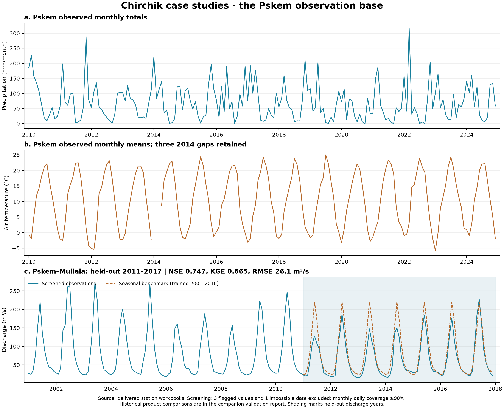

# Chirchik–Charvak: from observations to water-supply evidence

Pskem is the observed pilot. Chatkal, Ugam and Charvak are expansion domains requiring their own control sections and observations. Tashkent is a lowland comparison station, not an upstream forcing proxy.

## Results from the held data

Built with analysis version 1.0.0. Input hashes are in chirchik.manifest.json.

| Station | Variable | Period | Months | Missing |
| --- | --- | --- | ---: | --- |
| Tashkent | air_temperature_mean | 2010-01–2019-12 | 120 | None |
| Tashkent | precipitation_total | 2010-01–2019-12 | 120 | None |
| Pskem | air_temperature_mean | 2010-01–2024-12 | 177 | 2014-01, 2014-02, 2014-03 |
| Pskem | precipitation_total | 2010-01–2024-12 | 180 | None |
| Oygaing | air_temperature_mean | 2020-01–2022-12 | 36 | None |
| Oygaing | precipitation_total | 2020-01–2022-12 | 36 | None |

Discharge: 6,210 daily values, 2001-01–2017-12; 3 source-flagged values and 1 invalid calendar record(s) quarantined. 204 of 204 months meet 90% screened daily coverage. 0 raw months have missing days. Observed volume is reported only for complete screened months.

There are 93 eligible paired precipitation/temperature/discharge months (2010-01–2017-12). Temporal alignment is not a test of causality. Annual and seasonal volumes must not be obtained by summing monthly means.

The observed discharge climatology peaks in June. This is a descriptive full-record statistic; the forecast benchmark below uses only its training period.

### Held-out seasonal discharge benchmark

Monthly climatology trained on 2001–2010; evaluated on 2011–2017. No meteorological or satellite predictors are fitted in this first benchmark.

| Score | Value |
| --- | ---: |
| n | 84.0000 |
| mae | 17.8056 |
| rmse | 26.0943 |
| bias | 15.8996 |
| pbias | 23.8955 |
| nse | 0.7473 |
| kge | 0.6647 |
| r | 0.9572 |
| alpha | 1.2313 |
| beta | 1.2390 |

MAE/RMSE/bias are in m³/s; percent bias uses prediction minus observation. NSE and KGE have different benchmark interpretations; KGE zero is not a universal failure threshold. [Knoben et al. (2019)](https://hess.copernicus.org/articles/23/4323/2019/).

Whole-year bootstrap intervals and raw-versus-screened sensitivity scores are supplied in chirchik.json. Intervals condition on the fitted baseline and resample only seven held-out years; they do not capture rating-curve uncertainty.

Invalid-date source rows are preserved in discharge-rejected-dates.csv. The delivered daily table contains a 2015-02-29 entry, although 2015 was not a leap year. The case-study analysis excludes this impossible date before recomputing both raw and screened monthly means; it does not modify the source delivery.

### Spatial and validation status

The candidate Pskem trace has 20 level-12 units and 2626.9 km² of summed SUB_AREA. Whole outlet unit included. Gauge coordinate and reach snapping need review; this is not the full Chirchik basin or an exact gauge delineation.

All four station links are outside the existing broad headwater pilot. The Pskem candidate must be reviewed before basin-forcing extraction. Neither its area nor the brief's approximate full-basin area should be reported as a surveyed gauge area.

Station-product validation status: `raw_product_comparisons`. No score is fabricated for an absent or non-overlapping product. Historical cell extraction is separate from the existing basin-mean series.

| Station | Product | Variable | Season | Pairs | RMSE | Bias |
| --- | --- | --- | --- | ---: | ---: | ---: |
| Tashkent | era5-land | air_temperature_mean | all | 120 | 2.270 | -1.421 |
| Tashkent | era5-land | air_temperature_mean | DJF | 30 | 3.897 | -2.645 |
| Tashkent | era5-land | air_temperature_mean | MAM | 30 | 2.079 | -1.918 |
| Tashkent | era5-land | air_temperature_mean | JJA | 30 | 0.668 | -0.522 |
| Tashkent | era5-land | air_temperature_mean | SON | 30 | 0.807 | -0.597 |
| Tashkent | era5-land | precipitation_total | all | 120 | 16.630 | 6.725 |
| Tashkent | era5-land | precipitation_total | DJF | 30 | 10.396 | 4.008 |
| Tashkent | era5-land | precipitation_total | MAM | 30 | 28.351 | 21.955 |
| Tashkent | era5-land | precipitation_total | JJA | 30 | 8.472 | 1.458 |
| Tashkent | era5-land | precipitation_total | SON | 30 | 11.074 | -0.522 |
| Pskem | era5-land | air_temperature_mean | all | 177 | 7.233 | -7.128 |
| Pskem | era5-land | air_temperature_mean | DJF | 43 | 7.722 | -7.647 |
| Pskem | era5-land | air_temperature_mean | MAM | 44 | 7.451 | -7.363 |
| Pskem | era5-land | air_temperature_mean | JJA | 45 | 6.193 | -6.180 |
| Pskem | era5-land | air_temperature_mean | SON | 45 | 7.493 | -7.351 |
| Pskem | era5-land | precipitation_total | all | 180 | 41.593 | 34.094 |
| Pskem | era5-land | precipitation_total | DJF | 45 | 31.529 | 24.762 |
| Pskem | era5-land | precipitation_total | MAM | 45 | 46.713 | 39.788 |
| Pskem | era5-land | precipitation_total | JJA | 45 | 47.914 | 41.924 |
| Pskem | era5-land | precipitation_total | SON | 45 | 38.052 | 29.901 |
| Oygaing | era5-land | air_temperature_mean | all | 36 | 3.780 | -3.654 |
| Oygaing | era5-land | air_temperature_mean | DJF | 9 | 2.506 | -2.439 |
| Oygaing | era5-land | air_temperature_mean | MAM | 9 | 4.038 | -3.946 |
| Oygaing | era5-land | air_temperature_mean | JJA | 9 | 4.136 | -4.101 |
| Oygaing | era5-land | air_temperature_mean | SON | 9 | 4.177 | -4.132 |
| Oygaing | era5-land | precipitation_total | all | 36 | 72.822 | 51.039 |
| Oygaing | era5-land | precipitation_total | DJF | 9 | 11.836 | 8.492 |
| Oygaing | era5-land | precipitation_total | MAM | 9 | 60.756 | 43.240 |
| Oygaing | era5-land | precipitation_total | JJA | 9 | 127.758 | 125.153 |
| Oygaing | era5-land | precipitation_total | SON | 9 | 32.536 | 27.269 |

## 1. Which precipitation product captures the mountain water input?

**Status:** Raw product comparisons computed; correction experiments pending

How well do ERA5-Land and CHIRPS v3 reproduce monthly precipitation at Pskem, Oygaing and Tashkent, and does the error change with season and location?

**Hypothesis:** Product bias varies between the mountain stations and the lowland control; annual agreement can conceal winter underestimation and summer false rainfall.

**Observations:** Pskem 2010–2024; Oygaing 2020–2022; Tashkent 2010–2019. Monthly station totals in mm. The three-year Oygaing record supports a short-period check, not a climate trend.

### Protocol

1. Extract the native grid cell at each station. Sum all six CHIRPS v3 pentads in each calendar month; convert ERA5-Land monthly precipitation from metres to millimetres. Preserve product, image, coordinate and retrieval provenance.
2. Match station, variable and calendar month exactly. Keep missing values missing. Publish month counts, dry months, source transitions and paired coverage before scores.
3. Report raw bias (product minus observation), MAE, RMSE, correlation, and precipitation percent bias overall and for DJF, MAM, JJA and SON. Also score departures from a training-period monthly climatology so the seasonal cycle does not dominate correlation.
4. For any bias correction, fit only to Pskem 2010–2017 and evaluate 2018–2024; Tashkent uses 2010–2016 / 2017–2019. Keep Oygaing as a separate short external check. Never pool station-months before reporting each station.
5. Use whole-year block bootstrap intervals when enough paired years exist. Audit gauge undercatch, station relocation and whether a station contributed to the gridded product; label comparison independence unverified until that audit is complete.

### Evaluation

- MAE and RMSE (mm/month)
- Mean and percent bias
- Seasonal and anomaly correlation
- Paired-month and complete-year coverage
- Held-out correction versus raw-product skill

### Deliverables

- Station-by-product scorecard and seasonal error plots
- Monthly observed/product pairs with QC and provenance
- A justified forcing choice for Pskem with a transferability statement

### Evidence needed before stronger claims

- Historical station-cell extraction is absent from this checkout; the existing 2025–2026 basin means cannot validate 2010–2024 station observations.
- Station precipitation is a point measurement. Basin-mean precipitation requires separate spatial evaluation; a good station score alone does not validate catchment totals.

**Decision supported:** Select and, if justified on held-out years, correct precipitation inputs before fitting a runoff model.

Sources: [ERA5-Land monthly aggregates: bands, units and limitations](https://developers.google.com/earth-engine/datasets/catalog/ECMWF_ERA5_LAND_MONTHLY_AGGR), [CHIRPS v3 pentadal precipitation](https://developers.google.com/earth-engine/datasets/catalog/UCSB-CHC_CHIRPS_V3_PENTAD)

## 2. Temperature, elevation and the timing of melt

**Status:** Raw product comparisons computed; correction experiments pending

Does gridded air temperature reproduce the observed seasonal cycle and cold-season anomalies well enough to drive a snowmelt model?

**Hypothesis:** Elevation mismatch produces systematic station-cell temperature errors, with a seasonally varying correction outperforming a single annual offset.

**Observations:** Pskem has 177 of 180 monthly means, including three missing months in 2014. Oygaing has 36 monthly means and Tashkent 120. These are air-temperature observations, not land-surface temperature.

### Protocol

1. Extract ERA5-Land 2 m air temperature at the three station coordinates and convert kelvin to degrees Celsius. Record the grid elevation and verify station elevations before applying any lapse-rate correction.
2. Score monthly bias, MAE, RMSE and correlation by station and season. Retain the 2014 gaps and distinguish the Pskem workbook transition at 2020 from a demonstrated climatic discontinuity.
3. Compare raw temperature, a training-only offset, and a seasonal elevation correction only where station elevations are verified. Use the same chronological splits as the precipitation study.
4. Evaluate monthly warm/cold anomalies against a clearly named observational reference window. A 2010–2024 record is not a 1991–2020 climate normal.
5. Obtain daily temperature before estimating positive degree days, rain/snow partition or freeze–thaw events. Monthly means cannot reconstruct daily threshold crossings.

### Evaluation

- Bias, MAE and RMSE (°C)
- Seasonal and anomaly correlation
- Held-out error reduction
- Missing-month and elevation-mismatch audit

### Deliverables

- Station temperature validation panels
- Documented elevation correction, if supported
- Uncertainty ranges for subsequent snowmelt sensitivity experiments

### Evidence needed before stronger claims

- Station elevations and daily temperature are not verified by the monthly delivery.
- Do not infer melt timing or daily extremes directly from monthly temperature means.

**Decision supported:** Determine whether observed warming and melt-model inputs are robust to gridded-temperature bias.

Sources: [ERA5-Land monthly aggregates: bands, units and limitations](https://developers.google.com/earth-engine/datasets/catalog/ECMWF_ERA5_LAND_MONTHLY_AGGR)

## 3. From winter accumulation to Pskem summer flow

**Status:** Observed regime and benchmark computed

Can antecedent precipitation and snow conditions improve seasonal Pskem discharge estimates beyond the expected seasonal hydrograph?

**Hypothesis:** Winter accumulation and spring thermal conditions explain interannual flow variability beyond calendar-month climatology.

**Observations:** Pskem–Mullala daily discharge, 2001–2017, with climate overlap in 2010–2017. This gauge represents the Pskem tributary, not all Charvak inflow.

### Protocol

1. Recompute monthly means from daily values. Publish raw and screened versions using the source manifest's suspect-value flags; require at least 90% daily coverage for the primary monthly analysis. Require every day before reporting observed monthly volume.
2. Trace NEXT_DOWN upstream of the gauge's containing level-12 unit. Review the gauge position against the river reach and delineate the partial outlet unit before calling this an exact gauge catchment. Keep transboundary contributing units.
3. Build the first honest benchmark now: a calendar-month discharge climatology fitted on 2001–2010 and evaluated on 2011–2017. Report NSE, KGE (2009), bias, RMSE and MAE on eligible held-out months.
4. Backfill MODIS snow for 2000–2017 and basin forcing for at least 2000–2017, including model warm-up. Use cloud/QA masks and valid-area fractions; derive snow-covered area from an explicit classification, never interpret the NDSI value as fractional cover.
5. For an April 1 seasonal forecast, use only observations available by March 31. Compare an antecedent-precipitation model, then an added-snow model, using expanding-year validation within 2010–2017; report the very small number of independent years.
6. For process modelling, calibrate a parsimonious snow–soil–routing model and test on disjoint years. Convert area-weighted runoff depth to volume before routing. Compare against both monthly climatology and the same forcing model without snow predictors.

### Evaluation

- Held-out NSE and KGE with their components
- MAE, RMSE and percent volume bias
- April–September volume error and peak-month error
- Skill against training-only seasonal climatology
- Sensitivity to suspect discharge and missing days

### Deliverables

- Observed seasonal hydrograph and complete-year volumes
- Quality-controlled daily-to-monthly discharge audit
- Candidate upstream catchment and review status
- Seasonal forecast experiment with no future predictors

### Evidence needed before stronger claims

- The stored MODIS/ERA5 observations have no overlap with the historical discharge record. Their broad existing headwater selection excludes these stations.
- ERA5-Land runoff is local modelled runoff depth, not routed gauge discharge.
- Eight overlapping climate–flow years are insufficient for strong attribution claims; reserve conclusions until independent validation is available.

**Decision supported:** Test whether snow monitoring adds usable information for seasonal water planning.

Sources: [ERA5-Land monthly aggregates: bands, units and limitations](https://developers.google.com/earth-engine/datasets/catalog/ECMWF_ERA5_LAND_MONTHLY_AGGR), [MODIS/Terra daily snow cover, Version 61](https://nsidc.org/data/mod10a1/versions/61), [Knoben et al. (2019): interpreting NSE and KGE benchmarks](https://hess.copernicus.org/articles/23/4323/2019/)

## 4. Late-summer water and glacier dependence

**Status:** Inventory available; attribution requires modelling

How sensitive is late-summer Pskem flow to glacier loss, and how confidently can ice melt be separated from snowmelt and stored groundwater?

**Hypothesis:** Glacier melt can buffer dry late summers, but the magnitude is uncertain and cannot be identified from discharge alone.

**Observations:** The delivered Pskem glacier catalogue contains 254 records and is dated 2015 in the importer, despite the filename ending in 2023. It provides perimeter and elevation range, not glacier area.

### Protocol

1. Intersect dated RGI outlines with the reviewed Pskem, Chatkal and Ugam catchments. Retain inventory epoch, source region and boundary-crossing fractions; do not assume every catalogue record belongs to the gauge catchment.
2. Use RGI as a spatial inventory, not an independently suitable glacier-by-glacier change baseline. Map comparable late-ablation dates consistently with Landsat/Sentinel-2, seasonal-snow masks and manual debris/shadow review. Quantify outline uncertainty and harmonise sensor resolution.
3. Fit glacierised and non-glacierised process-model components using climate, snow cover and discharge jointly. Constrain ice loss with independent geodetic mass balance where available.
4. Report August–September ice-melt contribution as a model ensemble range under accepted parameter sets, and distinguish gross ice melt generated from routed water reaching the gauge.
5. Run glacier-area sensitivity scenarios with explicit climate assumptions; report them as scenarios rather than forecasts or causal historical attribution.

### Evaluation

- Glacier area change with outline uncertainty
- Independent mass-balance agreement
- Held-out August–September flow error
- Ensemble spread in routed ice-melt fraction

### Deliverables

- Dated, basin-linked glacier change inventory
- Late-summer dependence figure with uncertainty
- Assumption and identifiability register

### Evidence needed before stronger claims

- Perimeter cannot substitute for area; the 254 catalogue points do not establish a glacier-area trend.
- A good discharge fit does not independently validate ice-melt fraction. Groundwater, snow and ice contributions may compensate for one another.

**Decision supported:** Identify where late-summer supply may be sensitive to glacier change without claiming an unmeasured melt fraction.

Sources: [Randolph Glacier Inventory, Version 7](https://nsidc.org/data/nsidc-0770/versions/7)

## 5. Charvak water extent and storage uncertainty

**Status:** Historical image and level extraction required

What can public observations establish about Charvak filling, drawdown and storage change?

**Hypothesis:** Consistent reservoir extent and level observations reveal seasonal drawdown and anomalous years even when absolute storage remains weakly constrained.

**Observations:** The project has reservoir and dam reference layers. No observed Charvak storage, level, release or full tributary inflow time series has been established for these case studies.

### Protocol

1. Verify the reservoir polygon and dam outlet. Build monthly Landsat/Sentinel-2 water extents with sensor-specific cloud, shadow, snow and Landsat-7 gap handling; retain usable dates, valid coverage and within-month spread.
2. Use MNDWI/Otsu with visual shoreline QC and threshold sensitivity. Independently calibrate Sentinel-1 classification for radar shadow, layover, wind and ice before merging it with optical extents.
3. Seek ICESat-2 ATL13 and other altimetry crossings, checking date, vertical datum and shoreline contamination. Compare independent water levels only on matched dates.
4. Use exposed topography to constrain the observed elevation–area range. For new Earth Engine work pin COPERNICUS/DEM/GLO30_2024_1, which supersedes the brief's GLO30 asset. Integrate A(h) to estimate relative storage change; use surveyed bathymetry or an independently validated elevation–volume curve for absolute storage.
5. Treat below-waterline extrapolation anchored by reported capacity as a model scenario. Propagate shoreline, level, curve and capacity uncertainties; report missing months instead of guaranteeing a continuous record from 1984.
6. Interpret operations only after obtaining releases, diversions and the other tributary inflows. The Pskem gauge alone cannot close the Charvak water balance.

### Evaluation

- Water-mask precision/recall on held-out labelled scenes
- Cross-sensor extent disagreement
- Matched-date level RMSE
- Relative storage-change uncertainty
- Monthly observation completeness

### Deliverables

- Auditable reservoir area series and scene QC
- Relative storage change where independently constrained
- Drought-year comparisons and an absolute-storage evidence gate

### Evidence needed before stronger claims

- Copernicus GLO-30 does not observe submerged bathymetry; one reported capacity does not uniquely identify an elevation–volume curve.
- Station precipitation, temperature and upstream discharge are useful context, but do not validate reservoir volume or operational rules.

**Decision supported:** Publish the strongest supported storage indicator and its uncertainty, then upgrade it when independent level/volume information arrives.

Sources: [ICESat-2 ATL13 inland water user guide](https://nsidc.org/sites/default/files/documents/user-guide/atl13-v007-userguide.pdf), [Copernicus DEM GLO-30 and replacement notice](https://developers.google.com/earth-engine/datasets/catalog/COPERNICUS_DEM_GLO30)

## 6. Development pressure upstream of water supply

**Status:** Boundary and change validation required

Where has built-up land expanded around Charvak and within verified upstream conservation boundaries?

**Hypothesis:** Development is spatially concentrated near accessible shoreline areas, with exposure depending on hydrological connectivity rather than distance alone.

**Observations:** Existing basin and land-cover infrastructure can support the overlay. Verified protected-property boundaries, change labels and intake locations are still needed.

### Protocol

1. Define the reservoir shore zone and upstream catchments before analysis. Obtain dated legal boundaries and distinguish a national park, a World Heritage component and its buffer zone.
2. Use a consistent annual land-cover product and season; assess Dynamic World class probabilities with minimum observation counts. Use WorldCover as a cross-check, not a directly interchangeable change endpoint.
3. Validate stable and changed built-up classes with independent stratified image interpretation. Estimate area and uncertainty from the validation sample, including confusion with bare rock and construction soil.
4. Aggregate local built-up area by level-12 basin, then sum extensive quantities through the reviewed upstream network. Report local and cumulative measures separately without double counting.
5. Intersect population and intake locations for exposure. Do not infer contamination, regulatory violations or health impacts from land-cover change alone.

### Evaluation

- Built-up area and change with confidence intervals
- Change-class precision and recall
- Upstream area and exposed population with explicit dates
- Boundary and source-version completeness

### Deliverables

- Validated development-change map
- Basin-level exposure table with provenance
- A conservation/water-supply evidence brief

### Evidence needed before stronger claims

- Meteorological and discharge validation does not validate a land-cover classifier.
- A claim of development inside a World Heritage property requires the official component boundary and dated evidence.

**Decision supported:** Prioritise monitoring and field inspection where verified development drains toward water-supply infrastructure.

Sources: [Dynamic World V1](https://developers.google.com/earth-engine/datasets/catalog/GOOGLE_DYNAMICWORLD_V1), [ESA WorldCover 2021](https://developers.google.com/earth-engine/datasets/catalog/ESA_WorldCover_v200)

## Reproduction and next execution steps

```bash
npm run cases:build
npm run test:cases
# For historical gridded precipitation and temperature, after local EE authentication:
npm run cases:forcing
npm run cases:build
npm run build
```

1. Review source discharge flags and gauge/reach placement; confirm station elevations and product independence.
2. Run historical station-cell extraction; compare raw products before fitting corrections.
3. Delineate the approved gauge catchment, backfill snow and catchment forcing, then test seasonal forecasts on disjoint years.
4. Expand to Chatkal/Ugam and reservoir storage when their control sections and independent validation data are available.

Every output is associated with source hashes, processing version, time support and existing station/basin identifiers. Study statuses describe the analyses actually run; the remaining protocols are research work, not claimed completed validation.

## Exportable observation figure



[Download vector PDF](pskem-observation-evidence.pdf). Rebuild with `npm run cases:figures` after updating analysis results.
