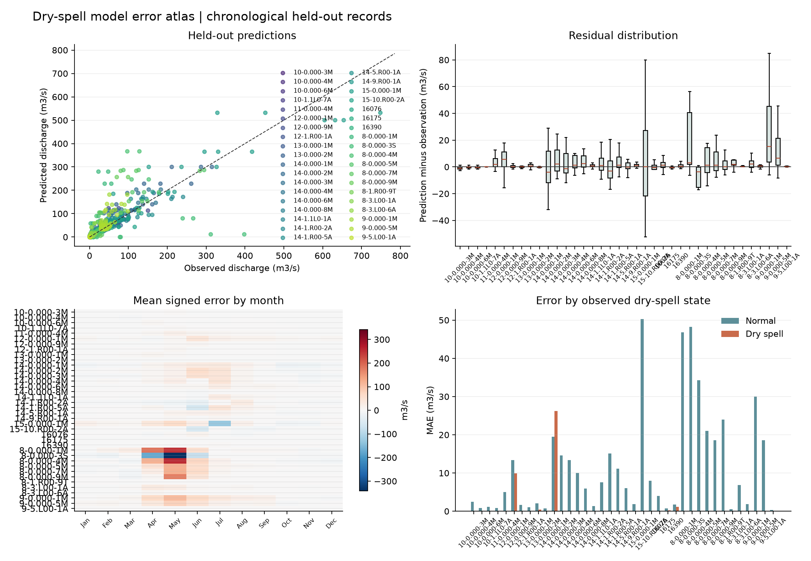
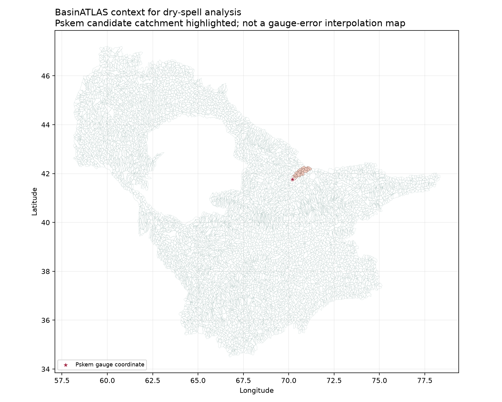
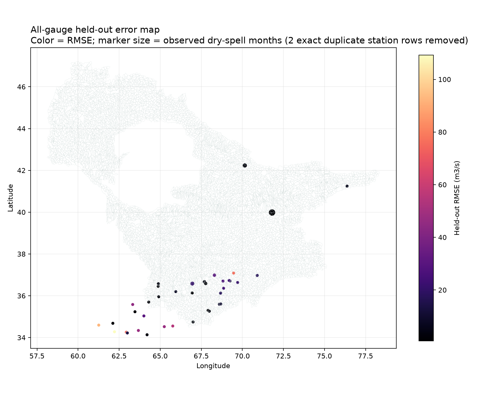
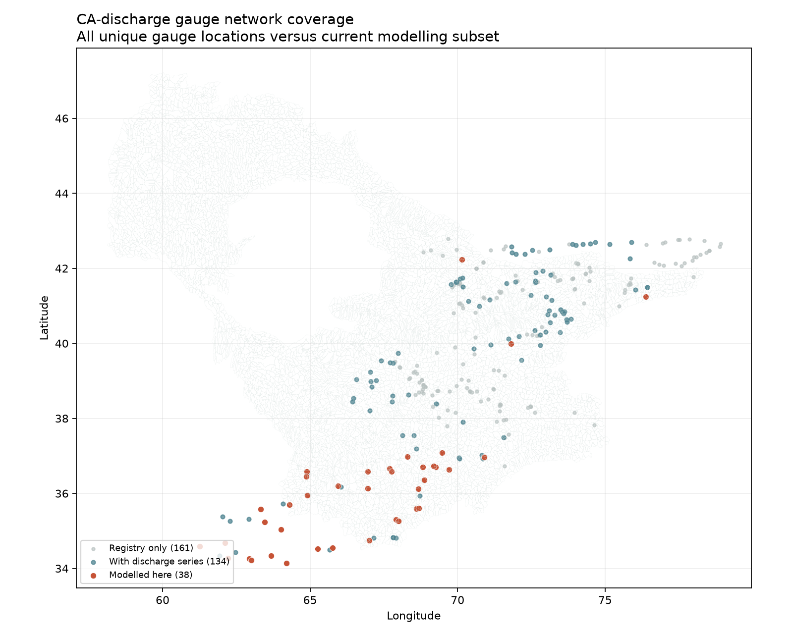

# Dry-Spell Held-Out Error Analysis

**Scope:** Corrected chronological validation predictions only.

The analysis contains **1,363 held-out records** across **38 gauges**. Overall p10-p90 interval coverage is **79.6%**. This is below nominal 90% and should not be described as calibrated uncertainty.

## Findings

- Mean absolute error during observed dry-spell months: **2.649 m3/s**.
- Mean absolute error during normal months: **10.308 m3/s**.
- Largest held-out RMSE: **8-0.000-3S (109.227 m3/s)**.
- Dry-spell months in the held-out sample: **24** of 1363 records.
- The low-flow threshold proxy marks a predicted dry month when predicted median discharge is below the gauge Q25. It is a diagnostic, not a validated dry-spell classifier, because the published dry-spell label also contains precipitation and AET conditions.

## Gauge summary

| Gauge | N | Bias (m3/s) | MAE | RMSE | Interval coverage | Dry months | Dry-state MAE | Normal MAE |
|---|---:|---:|---:|---:|---:|---:|---:|---:|
| 10-0.000-3M | 35 | -0.693 | 2.484 | 3.810 | 91.4% | 0 | nan | 2.484 |
| 10-0.000-4M | 16 | -0.509 | 0.858 | 1.424 | 25.0% | 0 | nan | 0.858 |
| 10-0.000-6M | 31 | 0.200 | 1.190 | 2.032 | 93.5% | 0 | nan | 1.190 |
| 10-1.1L0-7A | 23 | 0.425 | 0.824 | 1.750 | 91.3% | 0 | nan | 0.824 |
| 11-0.000-4M | 34 | 4.085 | 5.028 | 7.456 | 76.5% | 0 | nan | 5.028 |
| 12-0.000-1M | 35 | 9.352 | 13.102 | 20.829 | 88.6% | 3 | 9.898 | 13.403 |
| 12-0.000-9M | 24 | 0.897 | 1.623 | 2.846 | 70.8% | 0 | nan | 1.623 |
| 12-1.R00-1A | 24 | 0.463 | 1.030 | 1.876 | 62.5% | 0 | nan | 1.030 |
| 13-0.000-1M | 23 | 1.570 | 2.007 | 3.397 | 82.6% | 1 | 0.481 | 2.076 |
| 13-0.000-2M | 35 | -0.503 | 0.723 | 1.593 | 54.3% | 1 | 0.140 | 0.740 |
| 14-0.000-1M | 32 | 5.616 | 19.675 | 30.475 | 81.2% | 1 | 26.229 | 19.464 |
| 14-0.000-2M | 34 | 11.083 | 14.556 | 26.395 | 88.2% | 0 | nan | 14.556 |
| 14-0.000-3M | 35 | 8.242 | 13.361 | 24.026 | 88.6% | 0 | nan | 13.361 |
| 14-0.000-4M | 25 | 6.707 | 9.972 | 17.291 | 52.0% | 0 | nan | 9.972 |
| 14-0.000-6M | 27 | 4.822 | 5.926 | 9.061 | 66.7% | 0 | nan | 5.926 |
| 14-0.000-8M | 21 | 0.759 | 1.387 | 1.654 | 85.7% | 0 | nan | 1.387 |
| 14-1.1L0-1A | 34 | 3.228 | 7.607 | 12.165 | 79.4% | 0 | nan | 7.607 |
| 14-1.R00-2A | 35 | -3.418 | 15.134 | 22.022 | 74.3% | 0 | nan | 15.134 |
| 14-1.R00-5A | 29 | 1.871 | 11.108 | 21.099 | 86.2% | 0 | nan | 11.108 |
| 14-5.R00-1A | 34 | 3.525 | 6.064 | 10.418 | 79.4% | 0 | nan | 6.064 |
| 14-9.R00-1A | 24 | 1.381 | 1.878 | 2.811 | 75.0% | 0 | nan | 1.878 |
| 15-0.000-1M | 35 | 1.946 | 50.305 | 76.529 | 77.1% | 0 | nan | 50.305 |
| 15-10.R00-2A | 23 | -5.760 | 7.931 | 17.444 | 73.9% | 0 | nan | 7.931 |
| 16076 | 62 | 1.193 | 4.041 | 5.859 | 75.8% | 0 | nan | 4.041 |
| 16175 | 175 | -0.646 | 0.674 | 0.912 | 88.6% | 14 | 0.181 | 0.717 |
| 16390 | 99 | 0.650 | 1.732 | 2.991 | 64.6% | 4 | 1.123 | 1.758 |
| 8-0.000-1M | 23 | 45.728 | 46.824 | 92.429 | 82.6% | 0 | nan | 46.824 |
| 8-0.000-3S | 26 | -48.058 | 48.203 | 109.227 | 80.8% | 0 | nan | 48.203 |
| 8-0.000-4M | 30 | 28.699 | 34.227 | 75.362 | 70.0% | 0 | nan | 34.227 |
| 8-0.000-5M | 39 | 18.060 | 21.018 | 47.694 | 87.2% | 0 | nan | 21.018 |
| 8-0.000-7M | 39 | 15.876 | 18.615 | 47.000 | 92.3% | 0 | nan | 18.615 |
| 8-0.000-9M | 22 | 20.599 | 23.963 | 54.586 | 77.3% | 0 | nan | 23.963 |
| 8-1.R00-9T | 23 | 0.409 | 0.496 | 0.680 | 91.3% | 0 | nan | 0.496 |
| 8-3.L00-1A | 41 | 6.009 | 6.832 | 13.621 | 85.4% | 0 | nan | 6.832 |
| 8-3.L00-6A | 39 | 1.609 | 1.901 | 3.763 | 89.7% | 0 | nan | 1.901 |
| 9-0.000-1M | 23 | 28.464 | 30.019 | 45.108 | 69.6% | 0 | nan | 30.019 |
| 9-0.000-5M | 31 | 16.669 | 18.560 | 29.955 | 87.1% | 0 | nan | 18.560 |
| 9-5.L00-1A | 23 | 0.329 | 0.370 | 0.639 | 91.3% | 0 | nan | 0.370 |

## Figures

The BasinATLAS map is intentionally contextual. A complete verified gauge-to-basin coordinate crosswalk is not available for all gauges, so no unsupported spatial interpolation of model error is shown. The highlighted Pskem candidate catchment retains the existing reach-assignment warning.

## Interpretation limits

- Error magnitude is in cubic metres per second and is not comparable across gauges without flow normalization.
- Dry-spell error comparisons are sensitive to the rare-event count and should be paired with event-level recall and precision.
- The current analysis diagnoses continuous discharge error; it does not establish 1-, 2-, or 3-month dry-spell forecast skill.
- Basin attributes can stratify error and explain regime differences, but they do not replace time-varying climate forcing or validated routing.
