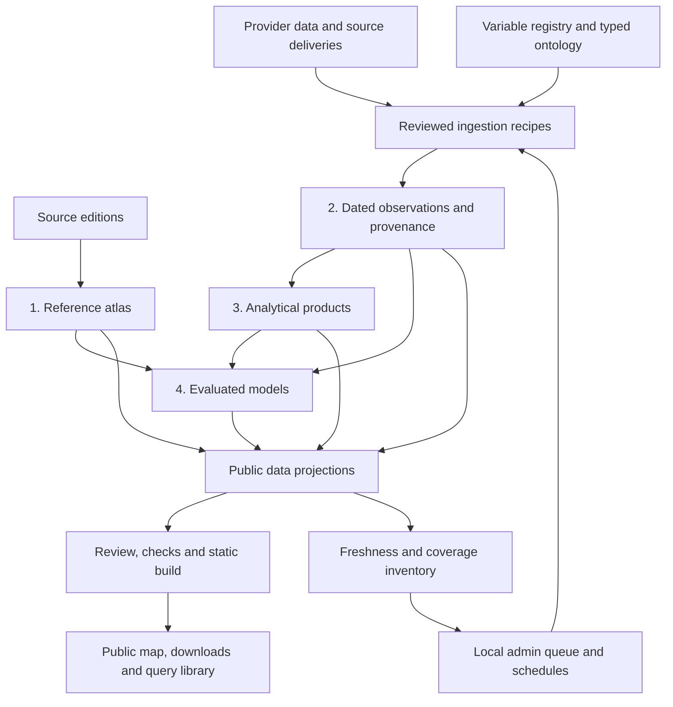

# UzGeoData

**Explore a basin. Compare its attributes. Download the evidence.**

UzGeoData is a public-preview basin atlas for the **Amu Darya and Syr Darya**
systems. Researchers can explore **7,445 level-12 basins**, read the 281 published
HydroATLAS attributes beside independent open-data estimates, and download
**monthly records from 2003 onward** with source and method provenance
(coverage varies by variable).

[Open the public preview](https://uzgeodata.uz/) ·
[Deployment status](https://github.com/tim7en/uzgeodata/actions/workflows/pages.yml) ·
[Report a problem](https://github.com/tim7en/uzgeodata/issues)

> **Release status: public preview.** No atlas attribute has passed independent
> scientific reproduction. Estimates can differ from HydroATLAS in source, period,
> resolution and method. **Snow is not for trend analysis:** missing months increase
> across the record and the cause is unresolved. See [limitations and reuse](DATA-LICENSING.md).

## Try it in five minutes

1. Open the map and zoom until the sidebar shows **Level 12**.
2. Select a basin, or search for a HYBAS ID such as `4120050220`.
3. Open **Atlas attributes**. Read the published values, then switch to
   **Independent estimates** and expand a row for its source, period and method.
4. Open **Monthly record**, choose a variable, and inspect the observed-month counts.
5. Download the CSV **and metadata JSON**, retaining units, limitations and provenance.

The public [guide](https://uzgeodata.uz/guide.html) includes direct
API downloads. Search uses the currently displayed basin level. Null values mean
missing observations, not zero. Upstream attributes already account for the
catchment above a basin and must not be added across basins.

## What ships

| Available | Scope |
| --- | --- |
| Basin map | Amu Darya and Syr Darya, across national boundaries |
| Published attributes | 281 HydroATLAS attribute definitions |
| Independent estimates | Coverage varies by attribute and basin; missing estimates stay explicit |
| Monthly record | 288 calendar positions, 2003–2026; actual non-null coverage varies by variable |
| Downloads | Basin JSON, shared catalogue, monthly CSV and provenance metadata |
| Query cube | 17.8M rows as partitioned Parquet, readable over HTTP byte ranges |
| Derived products | Normals, anomalies, seasonal figures, trends, water balance, SPI |
| Reading support | About, source reuse terms, citation, five-minute guide and issue reporting |

The saved snapshot includes snow, precipitation, evapotranspiration, soil moisture,
runoff, and minimum, mean, and maximum temperature. See the deployed `release.json` and history index for the actual snapshot.
The tracked September 2026 snapshot includes an ERA5 runoff append through August
2026; that does not extend every variable or rebuild the release. Calendar positions
include nulls and must not be read as observed-month counts.
The roadmap is future research scope, not a promise of completed features.

## What the platform offers

The strongest current offering is a connected basin research workflow: find a
basin, compare environmental attributes, inspect dated records, download usable
tables, and trace the source and method behind a result.

| Offering | Available now | Boundary |
| --- | --- | --- |
| Research-ready data | Basin attributes, monthly CSV/JSON and Parquet, units and source metadata | These are curated projections and estimates; the full raw evidence store and source deliveries are not all shipped publicly. |
| Research | Worked case studies, analytical recipes and model evaluations, including negative results | Evaluation is specific to its basin, inputs and period; it does not establish general forecasting skill. |
| Ontology | Typed concepts, datasets, assertions, provenance and registered relationship tables; basin and administrative geography remain distinct | A catalogue relationship does not itself compute a new spatial statistic. |
| Maintenance | Public inventory plus local grouped updates, schedules, progress and failure history | Acquisition needs the local worker, dependencies and source access; deployment is separate. |
| Machine assistance | TF-IDF similarity proposals, confidence calibration, validation and curator review | This is an existing proposal workflow, not an autonomous research agent or an LLM chat service. |

## Architecture: how the parts fit



`SERVER/dataUpdates.mjs` orchestrates work; Python in `PIPELINES/` performs it.
`ATLAS_MODULES/core/` defines observation and analysis contracts. `ONTOLOGY/`
provides semantic identity and relationships across those layers. `PUBLISHED/`
holds public outputs and `INTERFACE/` presents them. The diagram shows the full
path; the temporary append mode below bypasses the full-store rebuild.

### How a data update happens

1. Run `npm run admin` and open `http://localhost:5173/admin.html` after the
   [one-time Python/provider setup](docs/ADMIN.md). Local update controls require
   no sign-in. The public static page displays the saved inventory only.
2. Choose a registered **update group** or enable its daily, weekly or 30-day
   schedule. Related variables update together. Only allowlisted recipes run;
   duplicate active requests share one job and groups execute serially.
3. The server checks local inputs; the Python worker checks dependencies and
   Earth Engine access. For regional sources it queries availability and caps
   acquisition at the last completed month.
4. With the observation store and BasinATLAS geodatabase, regional updates run
   the full refresh. Without them, the temporary fallback extracts newer months
   into a scratch store and appends **history and cube only**. Climatologies,
   basin API, coverage ledger and release remain unchanged. The admin panel
   identifies which mode the available inputs support.
5. Successful pipeline steps are followed by inventory generation, then saved
   success timestamps. Failures retain their status and private logs. Pipeline
   outputs are not transactional: a failed later step can leave earlier outputs
   changed, so inspect them before retrying or publishing.
6. Review coverage, missingness, source/method metadata and the Git diff; run
   tests and `npm run build:launch`; commit reviewed outputs and deploy through
   the Pages workflow. An update job never publishes the live website by itself.

Schedules persist in `WORKSPACE/data-updates/state.json` and run only while the
server is online. Disabling a schedule stops future runs, not an active job.
“Last updated” measures processing freshness; “data covers through” measures the
observation period. A successful check does not imply new observations exist.
The legacy authenticated dataset upload API stores files separately; an upload
is **not** automatically a registered variable, observation or public release.

### Scaling the ontology and adding AI

Extend the existing contracts: register a concept and product, define units,
spatial support, source and method, add a validated ingestion recipe, map it to an
update group, and verify inventory coverage. Large measured relationships stay
in typed tables rather than becoming millions of manually curated assertions.

The existing `ontology:propose` and `ontology:review` commands support machine
suggestions and review; see [the ontology workflow](ONTOLOGY/README.md). A useful
next AI layer would resolve a question into known concepts, geography and periods,
check coverage, call approved query/product functions, and return citations and
missing-data explanations. Better embeddings can improve candidate matching.
Neither proposals nor generated explanations should invent observations, change
units, or create measured geographical relationships.

Priorities for that expansion are durable release snapshots and evidence retention,
a shared request/coverage interface, then one end-to-end question-to-analysis
workflow with evaluated answers. These are future capabilities; the current
platform already supplies the data, contracts and research examples to build on.

## Run the static preview

Requires **Node.js 22** and Git. A normal checkout includes the reviewed public
snapshot; no Earth Engine credentials, Python or private source files are needed
for the launch build.

```sh
npm ci
npm run build:launch
npm run preview:launch
```

Open `http://127.0.0.1:4173`. Deploy the resulting `dist/` to a static host.
`build:launch` does not run acquisition, regenerate the observation store or copy
raw observation partitions. It validates all 7,445 monthly records before building.

The live custom domain `uzgeodata.uz` uses `SITE_BASE=/`, as configured in the
[Pages workflow](.github/workflows/pages.yml). For a project-path deployment without
the custom domain, set `SITE_BASE=/uzgeodata/`. See [deployment, updates and rollback](docs/LAUNCH.md).

**Legacy development commands:** `npm run dev` and `npm run build` have publication
hooks that require Python and local inputs. Use the launch commands above to avoid
running those hooks during an active download.

## Public pages

The homepage remains the interactive basin map. `/project.html` explains the project,
scope, and research direction with an accordion sidebar; `/examples.html` provides
three worked research workflows and direct data downloads. About, guide, and
projects pages cover evidence, reuse, instructions, and future development.

The map no longer automatically fits the full region when data loads. It remembers
the last location and zoom when browser storage is available. **Reset view** returns
to the initial location; **Zoom to selected basin** and **Zoom to selected polygons**
fit the selected geometry. Normal zoom-dependent basin detail is unchanged.

## Static data API

Paths below are relative to the site root (`/uzgeodata/` on GitHub Pages).

| Path | Contents |
| --- | --- |
| `data/atlas/basins/index.json` | Basin IDs and estimate coverage |
| `data/atlas/catalogue.json` | Attribute definitions, units, sources and methods |
| `data/atlas/basins/<HYBAS_ID>.json` | Published values and independent estimates |
| `data/atlas/history/index.json` | Monthly variables, provenance and coverage |
| `data/atlas/history/<HYBAS_ID>.json` | Basin monthly values and their metadata |
| `data/atlas/cube/variable=<name>/*.parquet` | The whole dated record, one file per variable |
| `data/atlas/cube/index.json` | Cube manifest, variable registry and reading notes |
| `data/atlas/models/pskem-discharge.json` | The validated model result, skill included |
| `data/atlas/analysis-layers.md` | What the derived and model layers do, and refuse |
| `release.json` | Release commit, generation time and scope |

Monthly arrays start in January of the first stated year. Nulls retain their
positions. Annual totals are meaningful only for monthly flux quantities with all
12 observations. Download the shared catalogue with attribute files; positional
values are not self-describing without it.

## Use it as a library

The published release is queryable without a checkout. Nothing is downloaded
wholesale: the cube is Parquet, the host serves byte ranges, and a query reads the row
groups it touches.

```sh
pip install uzgeodata          # duckdb only; add [products] for SPI and anomalies
```

```python
import uzgeodata as uz

data = uz.open()                                   # the current published release
data.release_id                                    # 'uz-20260914T094910058Z'
data.series("4121289400", "precipitation", start="2023-01")
data.spi("4121289400", window=3)                   # gamma-fitted, not a z-score
```

**Record which data answered.** Every dataset resolves to a named release.
Print `data.release_id` with results and retain the input files. Manifests contain
SHA-256 hashes and `data.verify()` checks a local copy, but current manifests name
mutable artifact paths: pinning a release ID alone does **not** preserve old bytes.
Immutable snapshots and verification of the bytes served by the static build are
still required for durable reproduction. See [integrity boundaries](docs/ARCHITECTURE.md#deployment-and-integrity-boundaries).

**Usable is not defensible.** A dataset backed by the cube answers questions and
refuses to supply evidence:

```python
data.evidence("4121289400", "precipitation")
# Unavailable: this dataset reads the published cube, which carries no revisions,
# run ids, coverage counts or missing reasons. Evidence needs the observation record.
```

Returning nulls in those columns would read as "no coverage recorded" when the truth
is "this source does not carry coverage". For evidence, open a checkout's
`PUBLISHED/data/atlas`, which resolves to the same release and answers with provenance.

## Querying the cube directly

The dated record ships as Parquet partitioned by variable, so a query reads the one
file that answers it. The host serves byte ranges, which means a reader can query
twenty-two years without downloading them:

```sql
-- DuckDB, no download: reads only the row groups the query touches
SELECT year, month, value
FROM read_parquet('https://uzgeodata.uz/data/atlas/cube/variable=pre_mm_s/*.parquet')
WHERE basin_id = '4121289400' AND year >= 2020
ORDER BY year, month;
```

The cube is a read path, not the record: it carries no revisions, run ids, coverage
counts or missing reasons. Cite the store release named in its `index.json`. A null
is a month with no observation and is never a zero. Local basin support only —
upstream values cannot be summed across basins, so a cube inviting that sum would be
a trap.

## Analysis layers

Layer 1 is the reference atlas, Layer 2 the observation store. Above them:

**Layer 3 — derived products** (`ATLAS_MODULES/core/products.py`). Nothing is stored;
each product is derived on demand, so a correction below propagates rather than
leaving a stale derivative behind. A flux is summed and a state averaged, never the
other way round. A season short of a month yields no total. An anomaly baseline comes
from the whole record, never the window being examined. SPI is a real gamma fit per
basin and calendar month, not a z-score of accumulated rainfall — on a skewed record
the shortcut reads a genuine drought as unremarkable.

**Layer 4 — models** (`ATLAS_MODULES/core/models.py`). A model is the first output
here that is not a measurement, so the harness is mostly refusals: no score on the
training period, no fewer than 24 held-out months, no filled predictors, and skill
reported against climatology rather than only against the evaluation mean.

Validated against the Pskem gauge at Mullala, an independent hydromet record:
Nash–Sutcliffe **0.55**, and **−2.46 against climatology**. Read the second number.
Monthly climate does not predict this river — the bare seasonal cycle does better,
because snowmelt discharge runs on storage and lag a contemporaneous linear model
cannot see. The result is published as it came out. See
[analysis-layers.md](PUBLISHED/data/atlas/analysis-layers.md).

## Evidence contract

The underlying observation store is append-only. Revisions supersede earlier
observations. Units and periods cannot silently drift within a series; missing
values state a reason. Public projections retain source release, method and basin
geometry identifiers. Read the [observation contract](ATLAS_MODULES/core/REPRODUCIBILITY.md).
This protects traceability; it does not establish scientific reproduction.

## Checks and contribution

```sh
npm run test:ui
python -m pip install -r requirements.txt
python -m pytest TESTS -q
```

For a real browser check, install Playwright and Chromium, serve the static build,
and run `python TESTS/basin_substitutes_browser.py` with `ATLAS_TEST_URL` set to its
URL. This checks a regional basin outside the pilot, evidence and downloads.

Report problems through [GitHub issues](https://github.com/tim7en/uzgeodata/issues)
with the basin ID, page, attribute, expected behaviour and method/source identifier.
Keep credentials, raw source deliveries and active download checkpoints out of PRs.

## Repository map

Read the [four-layer architecture](docs/ARCHITECTURE.md) and
[admin data operations guide](docs/ADMIN.md). The variable inventory at
`/admin.html` shows freshness, coverage dates and update options across the
registered products. `npm run admin` starts the localhost-only update
server without triggering the legacy publication hooks; the static public site
shows the saved inventory only.

- `INTERFACE/` — React map, evidence views and public information pages.
- `PUBLISHED/` — reviewed browser data and public snapshots.
- `ATLAS_MODULES/` — scientific recipes, observation contract and programme plan.
- `PIPELINES/` — extraction, analysis, publication and static release builder.
- `TESTS/` — data-contract, model and browser checks.
- `ONTOLOGY/` — schemas, vocabularies and published relationships.
- `WORKSPACE/` — local derived data and checkpoints; excluded from Git.

The [development reference](docs/DEVELOPMENT.md) retains the full pipeline command
inventory. Source GIS deliveries and Earth Engine extraction need additional local
dependencies; see `requirements-pipelines.txt`.

## Citation and licences

Use [CITATION.cff](CITATION.cff), cite original source datasets, and record the
commit, access date, basin ID, period, source release and method. Source datasets
retain their own terms; no blanket third-party data or repository-wide software
licence is granted. See [DATA-LICENSING.md](DATA-LICENSING.md).
