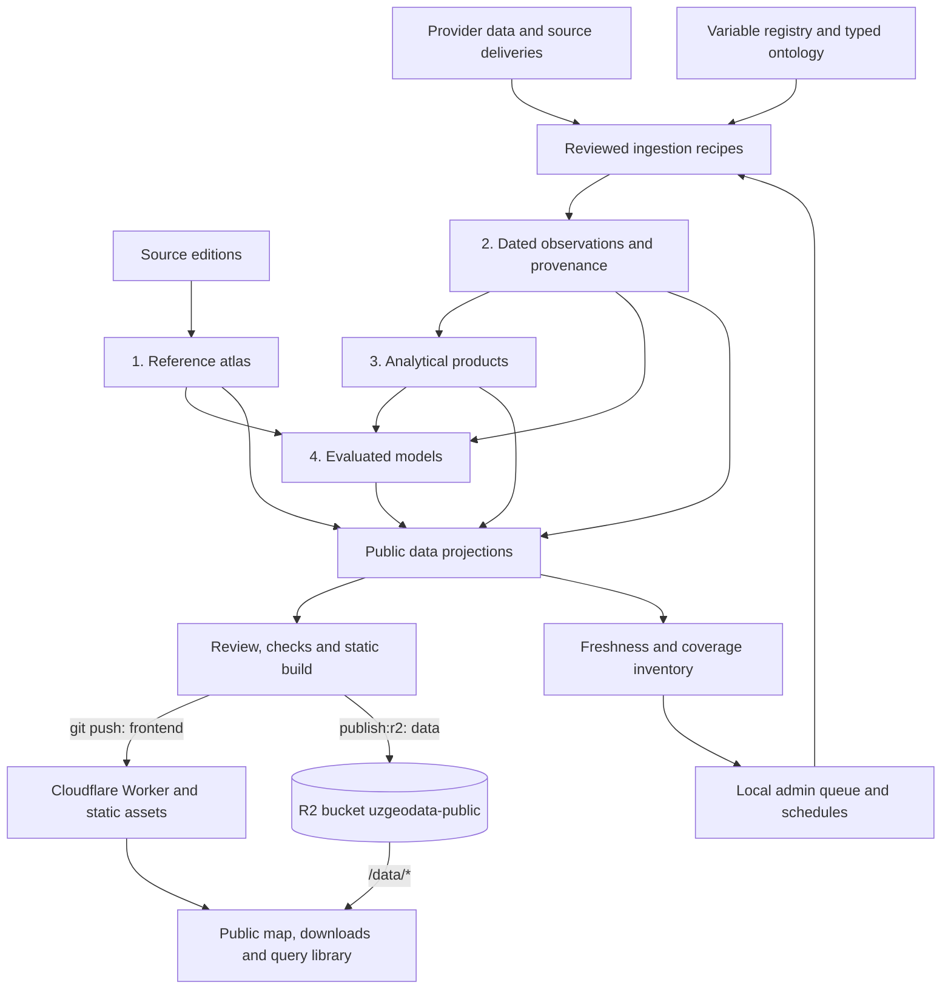
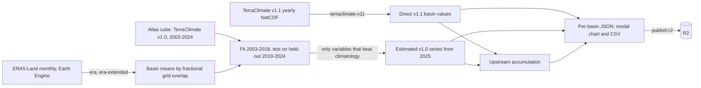

# UzGeoData

**Explore a basin. Compare its attributes. Download the evidence.**

UzGeoData is a public-preview basin atlas for the **Amu Darya and Syr Darya**
systems. Researchers can explore **7,445 level-12 basins**, read the 281 published
HydroATLAS attributes beside independent open-data estimates, and download
**monthly records from 2003 onward** with source and method provenance
(coverage varies by variable).

[Open the public preview](https://uzgeodata.uz/) ·
[Integrity checks](https://github.com/tim7en/uzgeodata/actions/workflows/ci.yml) ·
[Report a problem](https://github.com/tim7en/uzgeodata/issues)

> **Release status: public preview.** No atlas attribute has passed independent
> scientific reproduction. Estimates can differ from HydroATLAS in source, period,
> resolution and method. **Snow is not for trend analysis:** missing months increase
> across the record and the cause is unresolved. See [limitations and reuse](DATA-LICENSING.md).

## Try it in five minutes

1. Search for a HYBAS or PFAF identifier, such as `4120050220`, in the visible basin finder.
2. Select the result to see its monthly chart. Search covers all level-12 basins at any map zoom.
3. Choose a variable to visualize, or download all monthly variables as CSV or JSON with metadata.

Published attributes and independent estimates are available in adjacent tabs.
For multiple basins, choose **Draw area**, drag a rectangle, then choose a download.
The public [guide](https://uzgeodata.uz/guide.html) includes direct API downloads.
See [the workflow review](docs/WORKFLOW-REVIEW.md) for interaction budgets and remaining gaps.
Null values mean
missing observations, not zero. Upstream attributes already account for the
catchment above a basin and must not be added across basins.

## What ships

| Available | Scope |
| --- | --- |
| Basin map | Amu Darya and Syr Darya, across national boundaries |
| Published attributes | 281 HydroATLAS attribute definitions |
| Independent estimates | Coverage varies by attribute and basin; missing estimates stay explicit |
| Monthly record | 288 calendar positions, 2003–2026; actual non-null coverage varies by variable |
| Catchment statistics | Level-12 upstream catchments: area-weighted monthly means, sub-basin extremes, water-volume totals and derived morphology |
| Downloads | Basin JSON, shared catalogue, monthly CSV and provenance metadata |
| Query cube | 17.8M rows as partitioned Parquet, readable over HTTP byte ranges |
| Derived products | Normals, anomalies, seasonal figures, trends, water balance, SPI |
| Reading support | About, source reuse terms, citation, five-minute guide and issue reporting |

The snapshot carries fourteen variables: precipitation, actual and potential
evapotranspiration, total runoff (ERA5-Land) and TerraClimate runoff, soil moisture,
snow cover and snow water equivalent, minimum, mean and maximum temperature, climate
water deficit, vapour pressure deficit, and the Palmer drought severity index. See the
deployed `release.json` and history index for the actual snapshot.
Each variable ends where its source ends: ERA5-Land runoff and mean temperature run to
2026-08, the TerraClimate family to 2024-12, which is the latest month that product has
published. Calendar positions include nulls and must not be read as observed-month
counts.
The roadmap is future research scope, not a promise of completed features.

## What the platform offers

The strongest current offering is a connected basin research workflow: find a
basin, compare environmental attributes, inspect dated records, download usable
tables, and trace the source and method behind a result.

| Offering | Available now | Boundary |
| --- | --- | --- |
| Research-ready data | Basin attributes, monthly CSV/JSON and Parquet, units and source metadata | These are curated projections and estimates; the full raw evidence store and source deliveries are not all shipped publicly. |
| Research | Worked case studies, analytical recipes and model evaluations, including negative results | Evaluation is specific to its basin, inputs and period; it does not establish general forecasting skill. |
| Ontology | Typed concepts, datasets, assertions, provenance and registered relationship tables; basin and administrative geography remain distinct | A catalogue relationship does not itself compute a new spatial statistic. |
| Maintenance | Public inventory plus local grouped updates, schedules, progress and failure history | Acquisition needs the local worker, dependencies and source access; deployment is separate. |
| Machine assistance | TF-IDF similarity proposals, confidence calibration, validation and curator review | This is an existing proposal workflow, not an autonomous research agent or an LLM chat service. |

## Architecture: how the parts fit



`SERVER/dataUpdates.mjs` orchestrates work; Python in `PIPELINES/` performs it.
`ATLAS_MODULES/core/` defines observation and analysis contracts. `ONTOLOGY/`
provides semantic identity and relationships across those layers. `PUBLISHED/`
holds public outputs and `INTERFACE/` presents them. `worker.js` serves the
interface from Workers Static Assets and every `/data/*` request from R2, so code
and data are deployed separately (see [Publish data to Cloudflare R2](#publish-data-to-cloudflare-r2)).
The diagram shows the full path; the temporary append mode below bypasses the
full-store rebuild.

### How a data update happens

1. Run `npm run admin` and open `http://localhost:5173/admin.html` after the
   [one-time Python/provider setup](docs/ADMIN.md). Local update controls require
   no sign-in. The public static page displays the saved inventory only.
2. Choose a registered **update group** or enable its daily, weekly or 30-day
   schedule. Related variables update together. Only allowlisted recipes run;
   duplicate active requests share one job and groups execute serially.
3. The server checks local inputs; the Python worker checks dependencies and
   Earth Engine access. For regional sources it queries availability and caps
   acquisition at the last completed month.
4. With the observation store and BasinATLAS geodatabase, regional updates run
   the full refresh. Without them, the temporary fallback extracts newer months
   into a scratch store and appends **history and cube only**. Climatologies,
   basin API, coverage ledger and release remain unchanged. The admin panel
   identifies which mode the available inputs support.
5. Successful pipeline steps are followed by inventory generation, then saved
   success timestamps. Failures retain their status and private logs. Pipeline
   outputs are not transactional: a failed later step can leave earlier outputs
   changed, so inspect them before retrying or publishing.
6. Review coverage, missingness, source/method metadata and the Git diff; run
   tests and `npm run build:launch`. Publish data with `npm run publish:r2`, then
   commit and push the code, which deploys the frontend. `npm run publish:site`
   does both halves from one machine. An update job never publishes the live
   website by itself.

Schedules persist in `WORKSPACE/data-updates/state.json` and run only while the
server is online. Disabling a schedule stops future runs, not an active job.
“Last updated” measures processing freshness; “data covers through” measures the
observation period. A successful check does not imply new observations exist.
The legacy authenticated dataset upload API stores files separately; an upload
is **not** automatically a registered variable, observation or public release.

### Climate continuation beyond 2024

The atlas cube's TerraClimate v1.0 series ends in December 2024. A separate,
versioned package, `PUBLISHED/data/atlas/climate-continuation/`, carries the
record forward for all 7,445 basins without writing into the cube.
[The case study](CASE_STUDIES/regional-climate-continuation.md) gives the
method and scores.



- **Two products, never spliced.** *Direct v1.1* is the producer's own release,
  published about a year late. *Estimated v1.0* comes from ERA5-Land and continues
  the older statistic up to the latest ERA month. The producer advises against
  joining v1.0 and v1.1 into one trend, so the chart and downloads keep them apart.
- **Eleven continued variables.** Precipitation and minimum/maximum temperature
  use a per-basin, per-month offset or ratio
  (`model_regional_climate_continuation.py`). AET, PET, climate water deficit,
  runoff generation, soil moisture, SWE, VPD and PDSI map one ERA predictor's
  anomaly onto the v1.0 climatology (`model_regional_climate_water_balance.py`).
  A variable is published only if it beats the seasonal climatology on held-out
  MAE and RMSE in both river systems.
- **What it is not.** Estimates emulate a product; they are not station
  observations. Runoff `q` is modelled runoff generation, not observed or routed
  discharge.

Scripts, in the order `npm run climate:regional:update` runs them:

| Step | Command | Writes |
| --- | --- | --- |
| ERA precipitation and temperature | `climate:regional:era` | `era5-land/year=*.parquet` |
| ERA water and energy predictors | `climate:regional:era-extended` | `era5-land-extended/year=*.parquet` |
| Producer v1.1 years | `climate:regional:terraclimate-v11` | `terraclimate-v1.1/year=*.parquet` |
| Fit, test, estimate, accumulate | `climate:regional:continuation` | `v1.0*-continuation.parquet`, `upstream.parquet`, `report.json`, `water-balance-report.json` |
| Modal data | `climate:regional:web` | `basins/{HYBAS_ID}.json`, `basins-index.json` |

The package is gitignored and reaches the site only through R2:

```sh
npm run climate:regional:update      # needs Earth Engine access (ee-sabitovty)
python -m pytest TESTS/test_regional_climate_continuation.py -q
npm run publish:site                 # R2 sync, then wrangler deploy
```

**Adding a new year (for example 2027).** No code change is needed. Rerun the
update each month or quarter: the ERA steps extract to the newest ERA month and
finish the previous year once it is complete, estimates cover every month after
2024, and the chart axis follows the data. When the producer publishes a v1.1
year, it appears as a direct product next to the estimate, and `report.json`
records their agreement for that year under `v1.1_agreement_by_year`.

The coefficients stay fixed on 2003–2018, because v1.0 ends in 2024 and no new
v1.0 year will arrive to test against. Two checks remain:

1. `water-balance-report.json` → `rmse_by_year` holds held-out error for each
   year from 2019 to 2024. Model error that rises with distance from 2018 means
   the relationship is drifting. If model and climatology error rise together,
   the target itself is changing.
2. `v1.1_agreement_by_year` compares each estimated year with direct v1.1 for
   the same year. v1.1 is itself built on ERA5, so this checks consistency, not
   independent accuracy. A large jump from one year to the next is the signal
   worth investigating.

In the 2026-09 build, held-out error showed no drift from 2019 to 2024 for most
variables. The exception is Amu Darya SWE, where model and climatology error
both roughly quadruple, so the v1.0 SWE target itself is changing in
glacier-covered basins. SWE also disagrees most with direct v1.1 for 2025 (RMSE
571 mm, against 6 mm/month for precipitation). Treat SWE and Amu runoff estimates
with the most caution.

### Drought study, 1961–2025

A separate study at `/drought.html` uses TerraClimate v1.1's full 1960–2025
record, one product version with no splicing. It compares each water year
(October–September) for every basin with the 1991–2020 normal and the previous
10, 20 and 30 years, computes SPI-12 and PDSI, and follows upstream runoff
generation to Uzbekistan's regions. Every level-12 basin also has a **Drought
1961–2025** tab in the basin explorer. See
[the case study](CASE_STUDIES/drought-study.md). The data is gitignored and
published to R2 through `PUBLISHED/release-includes.txt`.

### Scaling the ontology and adding AI

Extend the existing contracts: register a concept and product, define units,
spatial support, source and method, add a validated ingestion recipe, map it to an
update group, and verify inventory coverage. Large measured relationships stay
in typed tables rather than becoming millions of manually curated assertions.

The existing `ontology:propose` and `ontology:review` commands support machine
suggestions and review; see [the ontology workflow](ONTOLOGY/README.md). A useful
next AI layer would resolve a question into known concepts, geography and periods,
check coverage, call approved query/product functions, and return citations and
missing-data explanations. Better embeddings can improve candidate matching.
Neither proposals nor generated explanations should invent observations, change
units, or create measured geographical relationships.

Priorities for that expansion are durable release snapshots and evidence retention,
a shared request/coverage interface, then one end-to-end question-to-analysis
workflow with evaluated answers. These are future capabilities; the current
platform already supplies the data, contracts and research examples to build on.

## Run the static preview

Requires **Node.js 22** and Git. A normal checkout includes the reviewed public
snapshot; no Earth Engine credentials, Python or private source files are needed
for the launch build.

```sh
npm ci
npm run build:launch
npm run preview:launch
```

Open `http://127.0.0.1:4173`. Deploy the resulting `dist/` to a static host.
`build:launch` does not run acquisition, regenerate the observation store or copy
raw observation partitions. It validates all 7,445 monthly records before building.

The live site is a Cloudflare Worker: [worker.js](worker.js) serves the interface
from Workers Static Assets and every `/data/*` request from the `uzgeodata-public`
R2 bucket. The custom domain `uzgeodata.uz` uses `SITE_BASE=/`. For a project-path
deployment set `SITE_BASE=/uzgeodata/`; that rebases both interface URLs and the
paths saved inside data catalogues. See [deployment, updates and rollback](docs/LAUNCH.md).

**Legacy development commands:** `npm run dev` and `npm run build` have publication
hooks that require Python and local inputs. Use the launch commands above to avoid
running those hooks during an active download.

## Publish data to Cloudflare R2

The live site is deployed in two halves. GitHub carries source, pipelines, metadata
and the reviewed public files, and a push to `main` builds and deploys the
**frontend** through Cloudflare Workers. That push moves no data: `build:cloudflare`
deletes `dist/data` on purpose, because the release is about 1 GB and the Worker
asset bundle must not carry it. `worker.js` answers `/data/*` from the
`uzgeodata-public` R2 bucket, so new data reach readers only once they are
published there:

```sh
npm run climate:web                # or whichever pipeline produced the data
npm run publish:r2 -- --dry-run    # what would change in the bucket
npm run publish:r2                 # build the release, then sync it
git add . && git commit -m "…" && git push   # code, pipelines, metadata, frontend
```

`PIPELINES/publish_r2.mjs` syncs `dist/data`, the validated release tree that
`build:launch` writes, rather than `PUBLISHED/data` directly. That is deliberate:
the launch build validates all 7,445 basin records, applies the git-tracked release
allowlist, excludes raw partitions and unpublished source geometry and compacts the
JSON, so syncing the working tree would publish files the release withholds. Each
file is published under its own site path, so `dist/data/atlas/catalogue.json`
becomes `/data/atlas/catalogue.json`.

The sync lists the bucket, uploads only objects whose MD5 or size differs from what
is stored, and sets the content types the pages depend on — including
`application/gzip` without `content-encoding` for the catchment matrices, which the
browser decompresses itself.

| Flag | Effect |
| --- | --- |
| `--dry-run` | report the difference, upload nothing |
| `--skip-build` | reuse an existing `dist/data` |
| `--prune` | also delete objects the release no longer contains |
| `--force` | allow a `--prune` run that would delete over a quarter of the bucket |
| `--only=<prefix>` | restrict the sync to one key prefix |
| `--concurrency=<n>` | parallel requests, default 12 |

Objects the release has dropped are reported but kept until `--prune` is passed: a
withdrawn file that still answers is a smaller problem than an unintended deletion.
`npm run publish:site` runs the whole deployment from one machine — publish the data,
strip `dist/data`, `wrangler deploy` — and builds the release once for both halves.

Credentials are R2 S3-API tokens in `.env` (`R2_ACCOUNT_ID`, `R2_ACCESS_KEY_ID`,
`R2_SECRET_ACCESS_KEY`; see `.env.example`), created in the Cloudflare dashboard under
R2 → API → Manage API tokens with Object Read & Write on the bucket. The wrangler
OAuth login is not enough: only the S3 API can list a bucket, and listing is what
makes this a sync instead of a blind re-upload of the whole release.

### Data that never enter Git

A dataset no longer has to be committed to be published. `git ls-files PUBLISHED` is
still one allowlist; `PUBLISHED/release-includes.txt` is the other — a tracked line
naming a path as public, whose data may be untracked and gigabytes large. To add a
dataset that lives only in R2:

1. Generate it under `PUBLISHED/data/…` as usual.
2. Add the path to `.gitignore`, so the commit stays small.
3. Add the same path to `PUBLISHED/release-includes.txt`; a directory line publishes
   every file beneath it.
4. `npm run publish:r2`.

The declaration is what makes a path public, and it is reviewed in Git like any other
change, so the default stays withhold: a file that is neither tracked nor declared is
not published. A declared path that a checkout does not have is reported and skipped,
so CI and a clone without the bulk tree still build — the basin validation still needs
the atlas records, which remain tracked and small.

With hosting on R2 the release byte budget in `build_launch.mjs` is no longer the
GitHub Pages 1 GB ceiling: it is 10,000 MB, settable with `RELEASE_BYTE_BUDGET`, and
kept only as a guard against a runaway pipeline.

The release published so far is still committed as well, so R2 is a second copy of it
today. Nothing has to change for that; new bulk data can take the R2-only route.

## Public pages

The homepage remains the interactive basin map. `/project.html` explains the project,
scope, and research direction with an accordion sidebar; `/examples.html` provides
three worked research workflows and direct data downloads. `/research.html` publishes
the research registry: the papers and datasets behind each of the four layers, with
their verification and validation status (`PUBLISHED/data/research/publications.json`).
About, guide, and projects pages cover evidence, reuse, instructions, and future development.

The map no longer automatically fits the full region when data loads. It remembers
the last location and zoom when browser storage is available. **Reset view** returns
to the initial location; **Zoom to selected basin** and **Zoom to selected polygons**
fit the selected geometry. Normal zoom-dependent basin detail is unchanged.

## Static data API

Paths below are relative to the site root. In production the Worker answers them
from R2; `npm run preview:launch` serves the same paths from `dist/`.

| Path | Contents |
| --- | --- |
| `data/atlas/basins/index.json` | Basin IDs and estimate coverage |
| `data/atlas/catalogue.json` | Attribute definitions, units, sources and methods |
| `data/atlas/basins/<HYBAS_ID>.json` | Published values and independent estimates |
| `data/atlas/history/index.json` | Monthly variables, provenance and coverage |
| `data/atlas/history/<HYBAS_ID>.json` | Basin monthly values and their metadata |
| `data/atlas/catchments/index.json` | Level-12 drainage network, local areas, series manifest and matrix hashes |
| `data/atlas/catchments/morphology.json` | Per-catchment area, perimeter, relief, slope and shape measures |
| `data/atlas/catchments/<variable>-<hash>.bin.gz` | One monthly matrix per variable, every basin in one file |
| `data/atlas/cube/variable=<name>/*.parquet` | The whole dated record, one file per variable |
| `data/atlas/cube/index.json` | Cube manifest, variable registry and reading notes |
| `data/atlas/models/pskem-discharge.json` | The validated model result, skill included |
| `data/atlas/analysis-layers.md` | What the derived and model layers do, and refuse |
| `release.json` | Release commit, generation time and scope |

Monthly arrays start in January of the first stated year. Nulls retain their
positions. Annual totals are meaningful only for monthly flux quantities with all
12 observations. Download the shared catalogue with attribute files; positional
values are not self-describing without it.

The catchment matrices are basin-major, quantized to 0.0001 native units, delta
encoded within each basin, byte-shuffled and gzipped; `index.json` states the
encoding, the scale, the null sentinel and a SHA-256 per file. Read them with
`decodeMatrix` in `INTERFACE/catchmentStatisticsModel.js` rather than by hand. A
catchment aggregate weights each sub-basin by its local `SUB_AREA`: its minimum and
maximum are extrema among sub-basin values, not pixel-level extremes, and a
full-catchment mean or total is withheld whenever any member basin lacks that
month. Serve the `.bin.gz` files without `Content-Encoding`, or the browser
decompresses them in transit and the published hash no longer matches.

## Use it as a library

The published release is queryable without a checkout. Nothing is downloaded
wholesale: the cube is Parquet, the host serves byte ranges, and a query reads the row
groups it touches.

```sh
pip install uzgeodata          # duckdb only; add [products] for SPI and anomalies
```

```python
import uzgeodata as uz

data = uz.open()                                   # the current published release
data.release_id                                    # 'uz-20260914T094910058Z'
data.series("4121289400", "precipitation", start="2023-01")
data.spi("4121289400", window=3)                   # gamma-fitted, not a z-score
```

**Record which data answered.** Every dataset resolves to a named release.
Print `data.release_id` with results and retain the input files. Manifests contain
SHA-256 hashes and `data.verify()` checks a local copy, but current manifests name
mutable artifact paths: pinning a release ID alone does **not** preserve old bytes.
Immutable snapshots and verification of the bytes served by the static build are
still required for durable reproduction. See [integrity boundaries](docs/ARCHITECTURE.md#deployment-and-integrity-boundaries).

**Usable is not defensible.** A dataset backed by the cube answers questions and
refuses to supply evidence:

```python
data.evidence("4121289400", "precipitation")
# Unavailable: this dataset reads the published cube, which carries no revisions,
# run ids, coverage counts or missing reasons. Evidence needs the observation record.
```

Returning nulls in those columns would read as "no coverage recorded" when the truth
is "this source does not carry coverage". For evidence, open a checkout's
`PUBLISHED/data/atlas`, which resolves to the same release and answers with provenance.

## Querying the cube directly

The dated record ships as Parquet partitioned by variable, so a query reads the one
file that answers it. The host serves byte ranges, which means a reader can query
twenty-two years without downloading them:

```sql
-- DuckDB, no download: reads only the row groups the query touches
SELECT year, month, value
FROM read_parquet('https://uzgeodata.uz/data/atlas/cube/variable=pre_mm_s/*.parquet')
WHERE basin_id = '4121289400' AND year >= 2020
ORDER BY year, month;
```

The cube is a read path, not the record: it carries no revisions, run ids, coverage
counts or missing reasons. Cite the store release named in its `index.json`. A null
is a month with no observation and is never a zero. Local basin support only —
upstream values cannot be summed across basins, so a cube inviting that sum would be
a trap.

## The four scientific layers in detail

The layers describe **what a result means and how it is produced**. They are not
four map layers, four databases, or four separately deployed services. A thematic
atlas combines products from these layers to answer questions about one subject.
The same precipitation record can support a water atlas and an agriculture atlas
without being acquired twice.

| Layer | Main question | Typical output | Changes when |
| --- | --- | --- | --- |
| **1. Reference** | What characterises this place under a stated edition or baseline? | Elevation, basin area, reference land-cover fractions, climate normals | An edition, geometry, method or explicitly chosen baseline changes |
| **2. Observations** | What was recorded or estimated here during this period? | A dated basin/month value with quality and provenance | New periods arrive or earlier observations are revised |
| **3. Analysis** | How does the record compare, vary or change? | Anomaly, seasonal total, trend, SPI, water-balance diagnostic | The selected input release, analysis period, baseline or recipe changes |
| **4. Models** | Can declared inputs explain or predict a target, or support a scenario? | Predictions, evaluation scores, fitted parameters, scenario results | A reviewed model version, input release, training period or scenario changes |

### Layer 1 — reference atlas

**Responsibility.** Describe the geography and its reference characteristics.
Existing examples include the 281 HydroATLAS attribute definitions, basin geometry,
topology, published reference values and independently calculated estimates.
A reference may be static, tied to a source epoch, or summarised over a stated
climatological period; “reference” does not mean “measured this year”.

**Inputs and processing.** Import an identified source edition, or apply a reviewed
recipe to source rasters/tables and versioned geometry. Preserve the distinction
between the original published value, a reproduction candidate and an estimate
made with another source. A new estimate does not overwrite the original simply
because it looks more recent.

**Outputs and representation.** The shared attribute catalogue defines labels,
units and methods; per-basin JSON carries values. The interface presents basin
profiles, maps and comparisons with source, period and spatial support visible.
Local basin values describe that polygon; upstream values describe its catchment
and cannot be added across nested basins.

**Code and storage.** [The HydroSHEDS module](ATLAS_MODULES/hydrosheds/module.json),
its [recipes](ATLAS_MODULES/hydrosheds/recipes.json),
[attribute runner](PIPELINES/run_atlas_attribute.py), and
`PUBLISHED/data/atlas/catalogue.json` plus `basins/` implement this path.
The common observation contract also represents reference records using explicit
time kinds; a separate physical database is not required for each layer.

**Update rule.** Import a new edition or deliberately recompute a named baseline.
Do not turn a fixed reference red simply because its publication date is old.
A normal computed in Layer 3 can become a Layer 1 reference when frozen with its
baseline, recipe and provenance; it then has a distinct published identity.

### Layer 2 — dated observations and evidence

**Responsibility.** Keep the environmental record with enough context to interpret
and revise it. “Observation” here includes provider-modelled estimates such as
ERA5 runoff and TerraClimate soil moisture, with their source type stated. It does
not imply a direct field measurement or a locally validated model.

**Inputs and processing.** Source files and provider collections enter approved
extraction recipes. Those recipes resolve geography, aggregate over the intended
area and period, convert units explicitly, and record missingness and coverage.
Regional updates acquire completed periods. Corrections append revisions that
supersede previous observations rather than silently replacing their evidence.

**Record contract.** [observations.py](ATLAS_MODULES/core/observations.py) validates:

- **Identity:** observation ID, basin ID, geometry version and attribute ID.
- **Space and time:** spatial support, time kind, valid period and temporal statistic.
- **Value and quality:** value, unit, valid/expected counts, coverage fraction,
  quality flag, missing reason and provisional status.
- **Provenance:** source release, recipe version, run ID, retrieval/recording times,
  revision and the observation it supersedes.

For example, a monthly precipitation value must identify *which basin geometry*,
*which month*, *which source and aggregation*, and *how much valid input contributed*.
A null remains missing; it cannot become zero rainfall. A change of unit or spatial
support must not silently enter an existing series.

**Code and storage.** The partitioned observation store under
`PUBLISHED/data/atlas/observations/` is read through
[query.py](ATLAS_MODULES/core/query.py), which accounts for completed runs and
revisions. [variables.py](ATLAS_MODULES/core/variables.py) maps concepts to versioned
products, preferred sources and explicit unavailable concepts. The store's current
contract is basin-oriented; support for arbitrary stations, parcels and grids needs
an explicit contract extension, not invented basin identifiers.

**Public representation.** `history/` supplies browser time series and `cube/`
supplies compact Parquet downloads/queries. These are projections: the public cube
does not carry the full revision and evidence record. Charts must distinguish
calendar positions from observed months and display coverage gaps.

**Update rule.** Acquire, validate and retain new/revised records, then rebuild the
necessary projections. The temporary admin append mode only extends history/cube;
it is not a substitute for retaining the full evidence store.

### Layer 3 — analytical products

**Responsibility.** Calculate an interpretable result from a declared record and
recipe: normals, anomalies, seasonal summaries, trends, water-balance diagnostics
and gamma-fitted SPI are implemented in
[products.py](ATLAS_MODULES/core/products.py).

**Inputs and processing.** Resolve a registered variable, geography, input release,
analysis window and reference period. Aggregation follows the variable's meaning:
a seasonal precipitation total sums monthly fluxes, while mean temperature averages
a state. Missing months are counted; incomplete flux seasons do not receive a full
seasonal total. Anomalies compare against a baseline independent of the requested
analysis window; callers can state a fixed baseline for comparable results.

**Outputs and representation.** An anomaly needs its baseline, units, contributing
sample counts and source context beside the value. A trend needs its period and
limitations. Present these as anomaly maps, seasonal charts, comparison tables and
downloadable analysis results, rather than labelling every coloured map a raw
measurement. The snow series remains withdrawn from trend analysis.

**Execution and update rule.** The core Python functions compute on demand from
the selected inputs; some other application pipelines publish stored analytical
tables and figures. Stored derivatives must be rebuilt when their inputs or recipe
change. Planned caching should key results by release, geometry, product version,
period, baseline and parameters so different analyses cannot share a stale result.
A universal dependency/caching service is not implemented yet.

**Boundary.** A precipitation-minus-evapotranspiration diagnostic is not a complete
river-flow model. An association or trend does not establish its physical cause.

### Layer 4 — evaluated models and scenarios

**Responsibility.** Fit or simulate a target using declared inputs, and evaluate
what the model can actually answer. This layer owns the project's modelling
experiment; modelled provider fields can already be inputs in Layer 2.

**Inputs and processing.** [models.py](ATLAS_MODULES/core/models.py) constructs
predictors from registered concepts and receives an independently identified target
series. The current fitting harness requires explicit, non-overlapping training
and evaluation periods, at least 24 held-out evaluation months, and enough training
observations. It drops months with missing predictors instead of inventing them.
It compares predictions with a seasonal climatology learned from the training data.

**Outputs and representation.** Report target, predictors, periods, coefficients,
predictions, retained/dropped months and skill against the reference forecast.
The Pskem monthly evaluation and specialised case-study pipelines are current
examples. Model pages should show observed-versus-predicted charts, held-out scores
and limitations; future scenario views must state assumptions and distinguish
simulated futures from recorded history.

The published Pskem monthly evaluation reports Nash–Sutcliffe efficiency **0.55**
but **−2.46 against climatology**: that fitted model loses to the seasonal reference
on its evaluation period. This is evidence about this experiment, not proof that
monthly climate can never help predict the river. See
[the evaluation notes](PUBLISHED/data/atlas/analysis-layers.md).

**Update rule.** New observations do not automatically justify refitting or
publishing a forecast. Select the input release and experiment, fit, evaluate and
review the result before promotion. General model version management, uncertainty
calibration and operational scenario/forecast serving remain planned work.

### Shared application services across all four layers

| Component | Current responsibility | Planned extension |
| --- | --- | --- |
| Ontology and variable registry | Name concepts/products, type relationships, preserve source and geography meaning | Resolve cross-atlas requests with explicit coverage and compatibility checks |
| Python pipelines | Acquire, validate and generate data through reviewed recipes | Declare shared dependencies and rebuild affected outputs consistently |
| Local Node admin | Queue allowlisted update groups, persist schedules and show progress/failure | Show downstream products affected by each update and release readiness |
| Publication | Export reviewed files and build the public static site | Immutable evidence/artifact retention, served-byte checks and recoverable releases |
| React interface | Read published data for maps, profiles, charts and evidence views | A shared atlas selector and consistent representations across themes |
| Query library | Read published series and run supported analyses | One request contract across themes, spatial frames and cached products |

**Example across the layers:** a basin's elevation and reference land cover (L1)
provide context for its dated precipitation and snow record (L2). A seasonal
precipitation anomaly (L3) describes that record against a baseline. A discharge
experiment (L4) uses selected predictors and is tested against gauge observations.
The ontology connects their meanings; the admin maintains their inputs; the website
presents their distinct evidence and limitations.

## Planned steps: more thematic atlases and representations

This is a proposed implementation sequence, not a claim that these atlases are
complete or a dated delivery commitment. It extends the
[module contract](ATLAS_MODULES/README.md) and existing
[scientific roadmap](ATLAS_MODULES/roadmap.json). Work is accepted through evidence,
not by changing a roadmap status alone.

### 1. Complete the shared data and release foundation

- Retain immutable public artifacts and the underlying evidence; test recovery of
  a previous release and verify the actual bytes distributed by the static build.
- Bind concept resolution to the selected release's variable registry.
- Declare dependencies between ingestion, public projections, analyses and models;
  show the outputs that a full or partial admin update has refreshed.
- Introduce a common request containing theme, concept/product, geography and its
  version, period, baseline and input release. Return coverage or an explicit reason
  the request cannot be answered.

**Acceptance:** one source correction produces traceable affected outputs, leaves
an older retained release readable, and cannot silently mix old/new products.

### 2. Establish the shared thematic atlas presentation

- Add an atlas selector while preserving the selected place and period where the
  destination theme supports them; explain incompatible selections.
- Give each atlas an overview, reference profiles (L1), dated records (L2), analysis
  views (L3), and an evaluated models section (L4) only when evidence exists.
- Reuse map legends, units, date/baseline controls, missing-data styling, comparisons,
  evidence panels and CSV/JSON/Parquet download metadata.
- Support explicit geography choices: basin/catchment, administrative area, station,
  raster or parcel as appropriate. A measured basin–district crosswalk supports
  intersection summaries; it does not make a basin mean a district observation.

**Acceptance:** two themes use the same selection/evidence components and preserve
product identity from map to chart to exported data. Unsupported views say why.

### 3. Add thematic modules in dependency order

Existing pages, source tables and studies are starting assets; each row below is a
planned coherent atlas module, not a claim of complete regional coverage. Start
with land/vegetation as the next module, prove the common workflow, then expand.

| Theme | Existing starting point | Planned content across the layers | Planned representation |
| --- | --- | --- | --- |
| **Water and hydroclimate** — consolidate the first atlas | HydroSHEDS reference module, basin histories, river networks and Pskem studies | L1 terrain/topology; L2 climate, runoff and eligible gauge records; L3 anomalies and water balance; L4 evaluated discharge experiments | Basin/catchment map, river-network view, monthly record, evidence and model evaluation panels |
| **Land cover and vegetation** — next module | Land-cover statistics/pages and reference attributes; no canonical regional NDVI/EVI time series yet | L1 class definitions and reference cover; L2 dated cover and quality-controlled NDVI/EVI; L3 change/seasonality; L4 separately validated classification or vegetation-response experiments | Categorical maps, year comparisons, class-area tables, vegetation curves and transition matrices |
| **Snow, glaciers and mountain systems** | MODIS snow work, glacier inventories and elevation-band products | L1 glacier editions and elevation zones; L2 snow/glacier observations and modelled snow-water equivalent kept distinct; L3 coverage-qualified seasonal metrics; L4 evaluated melt/storage experiments | Elevation-band profiles, glacier outlines, seasonal curves and explicit coverage gaps; trend views only after the snow issue is resolved |
| **Agriculture and land/water use** | Catalogued agricultural statistics and land-cover inputs | L1 crop/irrigation reference geography; L2 licensed production, vegetation and water-use records; L3 productivity/stress indicators; L4 evaluated demand/yield scenarios | Administrative/parcel views where supported, crop calendars, linked vegetation/water charts and scenario comparisons |
| **Ecosystems and environmental pressure** | Environmental reference catalogue and available infrastructure/pressure layers | L1 habitat and pressure inventories; L2 selected dated condition/pressure measurements; L3 reviewed change/exposure indicators; L4 models only with suitable targets and validation | Habitat/pressure maps, time-aware overlays and transparent indicator breakdowns |

Provider selection, licensing, spatial coverage and feasible resolution must be
reviewed in each module specification before its acquisition is implemented.
High-resolution or restricted source data may remain referenced rather than publicly
redistributed. No new theme must implement all four layers before it can be useful.

**Acceptance for each module:** a reviewed specification, one working ingestion
path, validated units/geography/time, inventory/update integration, one complete
map-to-evidence-to-download workflow, and a worked research example. Scientific
reproduction and model validation require their own evidence beyond this software gate.

### 4. Connect themes through the ontology and research workflows

- Register shared concepts once; keep source-specific products and differing spatial
  or temporal supports distinct. Represent measured topology in typed relationship
  tables and curated semantic claims as attributable assertions.
- Add cross-theme workflows, such as comparing vegetation change with precipitation
  anomalies and reference land cover for the same supported geography and period.
- Extend the observation/query contracts explicitly where station, parcel or grid
  data do not fit the existing basin record; preserve geometry versions and licences.
- Provide reusable research examples with inputs, method, result, limitations and
  a downloadable package. Do not present associations as causal findings.

**Acceptance:** one cross-atlas analysis can be repeated from retained inputs and
its query specification, with no implicit source substitution or geographic join.

### 5. Add AI assistance above the validated data services

- Improve the existing ontology proposal/review workflow with evaluated matching
  methods and curator feedback; keep measured geographical facts pipeline-owned.
- Let a question assistant propose concepts, geography, periods and an analysis;
  resolve ambiguities and check coverage before using approved query functions.
- Return the actual product/release, recipe, source citations and missing-data
  explanations with the answer. Acquisition remains an explicit approved operation.
- Evaluate on a fixed collection of questions, including unsupported concepts,
  incompatible units, absent periods and misleading source substitutions.

**Acceptance:** answers can be traced to executable requests and retained results;
the assistant reports unsupported requests correctly and cannot promote its own
ontology guesses into scientific evidence.

## Evidence contract

The underlying observation store is append-only. Revisions supersede earlier
observations. Units and periods cannot silently drift within a series; missing
values state a reason. Public projections retain source release, method and basin
geometry identifiers. Read the [observation contract](ATLAS_MODULES/core/REPRODUCIBILITY.md).
This protects traceability; it does not establish scientific reproduction.

## Open findings

Known and unfixed, recorded so they are picked up deliberately rather than
rediscovered. Detail and the measurements behind them are in
[docs/LAUNCH.md](docs/LAUNCH.md#open-findings).

- **Catchment tab reads unextended months as gaps.** The monthly frame is 288
  calendar positions but the record runs to 2024-12, so the catchment table and CSV
  end with 24 rows at `0%` coverage. Nothing is misstated; a current dataset just
  looks like it has a two-year hole. Fix is local to
  `INTERFACE/catchmentStatisticsModel.js` and needs no rebuild of published data.
- **The withheld-layer notice is published but never rendered.** The release
  excludes 25 `data/review/` source-geometry files and records the reason in
  `data/review-layers.json`; `INTERFACE/LayerReview.jsx` never reads it, so the
  review page lists 13 layers with no explanation of the other 25.
- **`pytest TESTS` fails on `main`.** Three unrelated pre-existing failures keep
  the `integrity` workflow red, so it no longer signals anything. See
  [docs/LAUNCH.md](docs/LAUNCH.md#open-findings) for which and why.
- **The GitHub Pages workflow can no longer build the release.** The release is
  now over 1.2 GB and Pages publishes at most 1 GB. The live site serves data from
  R2, so this only matters for the manual Pages preview, which stays as a rollback.

## Checks and contribution

```sh
npm run test:ui
python -m pip install -r requirements.txt
python -m pytest TESTS -q
```

For a real browser check, install Playwright and Chromium, serve the static build,
and run `python TESTS/basin_substitutes_browser.py` with `ATLAS_TEST_URL` set to its
URL. This checks a regional basin outside the pilot, evidence and downloads.

Report problems through [GitHub issues](https://github.com/tim7en/uzgeodata/issues)
with the basin ID, page, attribute, expected behaviour and method/source identifier.
Keep credentials, raw source deliveries and active download checkpoints out of PRs.

## Repository map

Read the [four-layer architecture](docs/ARCHITECTURE.md) and
[admin data operations guide](docs/ADMIN.md). Draft research papers built on the
published release live in [docs/papers/](docs/papers/); the first draft analyses
basin-scale trends and water-balance diagnostics across both systems. The
variable inventory at
`/admin.html` shows freshness, coverage dates and update options across the
registered products. `npm run admin` starts the localhost-only update
server without triggering the legacy publication hooks; the static public site
shows the saved inventory only.

- `INTERFACE/` — React map, evidence views and public information pages.
- `PUBLISHED/` — reviewed browser data and public snapshots.
- `ATLAS_MODULES/` — scientific recipes, observation contract and programme plan.
- `PIPELINES/` — extraction, analysis, publication and static release builder.
- `TESTS/` — data-contract, model and browser checks.
- `ONTOLOGY/` — schemas, vocabularies and published relationships.
- `WORKSPACE/` — local derived data and checkpoints; excluded from Git.

The [development reference](docs/DEVELOPMENT.md) retains the full pipeline command
inventory. Source GIS deliveries and Earth Engine extraction need additional local
dependencies; see `requirements-pipelines.txt`.

## Citation and licences

Use [CITATION.cff](CITATION.cff), cite original source datasets, and record the
commit, access date, basin ID, period, source release and method. Source datasets
retain their own terms; no blanket third-party data or repository-wide software
licence is granted. See [DATA-LICENSING.md](DATA-LICENSING.md).
