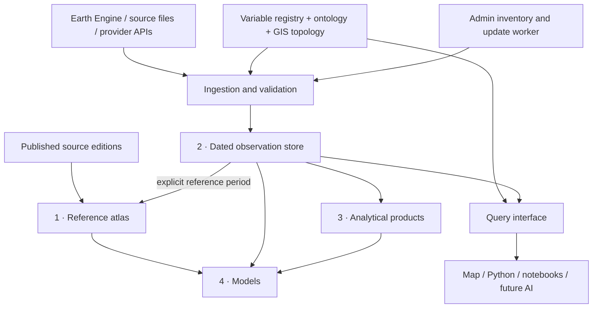

# UzGeoData architecture

Updated 15 September 2026. This is the project-wide architecture; the
[hydroclimate plan](../HYDROCLIMATE_REFACTOR_PLAN.md) describes a research programme
within it. Implementation status is distinguished from intended capabilities.

## Four distinct analytical layers

| Layer | Responsibility | Current implementation | Update rule |
| --- | --- | --- | --- |
| **1. Reference** | Describe a basin or place using a stated edition, epoch or climatological window. Keep published reference values distinct from independent estimates. | 281 HydroATLAS attributes; independent descriptive estimates; environmental catalogue, terrain and topology. `catalogue.json`, per-basin JSON, static/climatology observation partitions. | A new source edition or an intentional recomputation of a stated period. Age alone does not invalidate a fixed reference. |
| **2. Observations** | Preserve dated measurements and modelled environmental estimates, including missing values, spatial support, units and provenance. | Fourteen canonical basin/month variables in the regional cube; additional source-specific relationship tables. `core/observations.py`, `core/query.py`, extraction pipelines, history JSON and Parquet. | Acquire new complete periods, retain corrections as revisions, validate coverage and release the resulting data. A modelled runoff field is not gauged discharge. |
| **3. Analytical products** | Derive results from a declared observation release and recipe. | Normals, anomalies, seasonal figures, trends, water balance and gamma-fitted SPI in `core/products.py`; additional published anomaly tables. | On-demand products read the selected input release. Stored products need a rebuild when their inputs or recipe change. |
| **4. Models** | Fit or simulate a response using identified inputs and evaluate against independent observations. | `core/models.py`, the Pskem monthly evaluation, and specialised case-study models. | Refit deliberately with declared predictors, training/evaluation periods, geometry and model recipe. A successful run does not establish predictive skill. |

The layers are scientific responsibilities, not four separate servers. A
climatological estimate derived from observations belongs to the reference layer
when exposed as a descriptive basin attribute; an anomaly derived from that
baseline belongs to layer 3. Representations never share an identity merely
because their labels contain “precipitation”.

## Shared data contracts

`ATLAS_MODULES/core/observations.py` owns the long record. Its fields include
basin ID, geometry version, variable/attribute ID, observation period, value,
unit, spatial support, quality and missing reason, source release, recipe, run
and revision. Corrections supersede records; nulls never become zero. Reference,
climatology and observation time kinds remain distinct. See
[the reproducibility contract](../ATLAS_MODULES/core/REPRODUCIBILITY.md).

`core/variables.py` maps concepts to versioned analytical products and one
preferred representation per concept. A fallback declaration is explanatory
metadata: it is not permission to substitute a different scientific source
silently. Coverage in newly built cube registries is measured from the data,
including the latest non-null observation month, rather than requiring a source
code edit each year.

The cube is an efficient read projection of layer 2, not its complete evidence
record. History JSON and the cube originate from completed runs. The public
library can read the cube without Earth Engine credentials; detailed record
evidence requires the observation store. The tracked history has calendar positions for 2003–2026, including an ERA5
runoff append through August 2026. Other variables retain their own coverage;
the inventory must show observed periods separately from processing dates.

The ontology supplies vocabulary, dataset relationships and declarations of
measured geography. It does not yet turn an arbitrary research question into an
executable acquisition plan. Upstream catchments and administrative intersections
must preserve their spatial meaning; a basin mean cannot answer a high-resolution
polygon request without an appropriate new computation.

## Data operations and admin page

`/admin.html` is the data freshness inventory. It works as a published snapshot
on static hosting and exposes operations, without sign-in, on the localhost-only `server.mjs`.
`/admin` and `/admin/variables` redirect to it on that server.

The inventory is generated by `PIPELINES/build_variable_inventory.py` from:

- All reference attributes and registered independent estimates in the atlas catalogue.
- Every canonical observation variable in the cube registry and extraction ledgers.
- Every ontology relationship table, expanded into its distinct named variables.
- Catalogue properties for datasets not already represented by those relationship tables.
- Core analytical products and the Pskem monthly model evaluation.

This produces 849 product rows in the present snapshot. These are representations
with distinct sources or scopes, not 849 independent physical quantities. Missing
tables and catalogue-only products remain visible. An unregistered file is not
automatically a variable: new products must enter a registry and the inventory
coverage tests must continue to pass.

### Freshness is not completeness

For a variable with an update interval and a reliable timestamp:

`freshness = clamp(100 × (1 − elapsed_days / interval_days), 0, 100)`

60–100 is green, 25–59 amber, and below 25 red. The browser recalculates against
the current time. The page states what timestamp it is using; it never uses the
checkout filesystem modification time or inventory generation time as an
acquisition date. Legacy tables explicitly identify dates from the recorded
currency audit. Fixed references, historical records, on-demand outputs and
unknown timestamps have neutral, unscored bars. Missing products are marked
missing, not healthy.

“Data covers through” is a separate field, evaluated against the update interval.
A recent extraction of an old record can therefore show a high update-freshness
score and still require coverage attention. Coverage age is a diagnostic, not a
claim that the upstream provider offers a newer observation. Job progress is
shown separately and measures execution stages, not freshness or completeness.

### Update execution

`ATLAS_MODULES/update-groups.json` is the reviewed operation allowlist. Related
variables share a source group. The regional groups cover TerraClimate water
balance, TerraClimate temperature, ERA5 temperature/runoff and MODIS snow.
Additional groups cover existing hydroclimate, land-cover and Pskem model pipelines.
Products without an approved group expose metadata and existing maintenance
instructions, not a nonfunctional “Update” button.

The localhost-only Node service persists a serial job queue and per-group schedules
in `WORKSPACE/data-updates/state.json`. It accepts group IDs, never shell text.
Duplicate active requests reuse the same job. Input prerequisites are checked
before queuing; the Python worker additionally checks dependencies and provider
authentication before execution. A failed or interrupted job never becomes a
successful update. Jobs interrupted by a server restart require review and an
explicit retry. A worker lock prevents two admin servers writing the same state.

Regional updates probe provider availability, limit the target to a completed
month and run the existing extraction/publication dependency chain. Extensions
within the same year are supported. Refresh jobs bypass stale year checkpoints,
stamp changed records as revisions and return a failing exit code for incomplete
extractions. Successful groups regenerate the inventory; persisted group success
timestamps survive later inventory rebuilds.

Schedules are opt-in: off, daily, weekly or every 30 days. They run while the admin
server is online, persist across restarts, and perform one catch-up when overdue.
They do not configure an always-on cloud service. They update local outputs and
do not push commits or deploy the public site. See [admin setup](ADMIN.md).

## Deployment and integrity boundaries

The public site is a static GitHub Pages artifact. It has no Python worker,
credentials, private job state or Node API. The admin server defaults to localhost;
remote operation requires an explicitly provisioned authenticated server with
HTTPS, the source inputs and persistent storage. Provider credentials never enter
browser bundles or public inventory files.

Git versions source and reviewed publication files. Raw observation partitions,
Earth Engine checkpoints, credentials and large source geodatabases stay outside
Git. A clean checkout can display and query published data but cannot silently
reconstruct the omitted evidence needed for an incremental update.

Release manifests record file hashes. The existing release implementation names
mutable artifact paths: **pinning a manifest is not yet immutable data retention**.
The review found eight metadata mismatches in the current local manifest. This
admin feature does not erase the old manifest or claim to repair past reproducibility.
Before a citable production release, implement immutable object paths or release
snapshots, retain the evidence record and verify the actual served bytes. Static
build JSON compaction also changes bytes and must be reconciled with hashes.

## Remaining architectural work

1. Preserve immutable release data and evidence, and bind library concept resolution
   to the selected release registry.
2. Add a common multi-variable request/coverage interface and connect one missing
   product to acquisition, harmonization and caching.
3. Route additional case studies through that interface, with provenance traveling
   with model and analytical outputs.
4. Add NDVI/EVI and other justified variables as reviewed products; connect uploaded
   user data and geography resolution after that path works.
5. Add AI planning and reporting above the analytical layers. AI does not determine
   units, silently change providers, repair missing observations or approve models.

## GitHub review, 14 September 2026

At commit `4a58794f33bd6c545d68f3f36aeea8d323391d59`, the
[Public preview run](https://github.com/tim7en/uzgeodata/actions/runs/34863663672)
passed and the [integrity run](https://github.com/tim7en/uzgeodata/actions/runs/34863663653)
failed in `test_a_failed_rebuild_stops_rather_than_continuing`. That isolated
failure test queried raw observation partitions excluded from CI. It now supplies
its test period explicitly, preserving the assertion that failed upstream
accumulation stops publication. No checks were disabled.

Repository rulesets were empty and the branch API reported `main` unprotected
with no required status checks. The detailed protection endpoint was unavailable
to the integration. No open issues were returned. There was no applicable local
`AGENTS.md`, CODEOWNERS or repository contribution restriction found. These are
observations at review time, not a promise about future repository settings.
